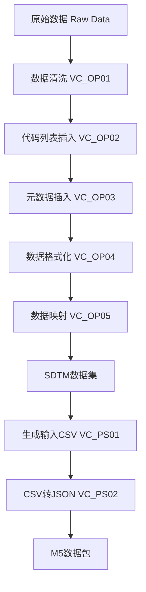

# VAPORCONE Clinical Data Processing System

## 项目概述

VAPORCONE 是一个专门用于临床试验数据处理和迁移的系统，主要功能是将原始的临床试验数据（Raw Data）转换为符合 CDISC SDTM（Study Data Tabulation Model）标准的数据格式，并最终生成可用于监管提交的 M5 数据包。

## 项目架构

```
VAPORCONE/
├── 基础模块 (BC - Base Components)
│   ├── VC_BC01_constant.py           # 常量定义与配置加载
│   ├── VC_BC02_baseUtils.py          # 基础工具函数
│   ├── VC_BC03_fetchConfig.py        # 配置文件读取
│   ├── VC_BC04_operateType.py        # 数据类型操作调度
│   ├── VC_BC05_studyFunctions.py     # 研究特定函数
│   └── VC_BC06_operateTypeFunctions.py # 操作类型具体实现函数
├── 操作模块 (OP - Operations)
│   ├── VC_OP01_cleaning.py           # 数据清洗
│   ├── VC_OP02_insertCodeList.py     # 代码列表插入
│   ├── VC_OP03_insertMetadata.py     # 元数据插入
│   ├── VC_OP04_format.py             # 数据格式化
│   ├── VC_OP05_mapping.py            # 数据映射
│   └── VC_OP06_combine.py            # 数据合并(实验性)
├── 后处理模块 (PS - Post Processing)
│   ├── VC_PS01_makeInputCSV.py       # 生成输入CSV
│   └── VC_PS02_csv2json.py           # CSV转JSON数据包
├── 配置文件
│   ├── project.local.json            # 本地项目配置文件
│   └── requirements.txt              # 项目依赖
├── 研究特定配置
│   ├── studySpecific/CIRCULATE/      # CIRCULATE研究配置
│   └── studySpecific/COSMOS_GC/      # COSMOS_GC研究配置
└── 实验性功能
    └── experiment/combine_test/      # 数据合并测试
```

## 核心功能模块

### 1. 基础模块 (BC - Base Components)

#### VC_BC01_constant.py
- **功能**: 定义项目全局常量及加载本地配置
- **主要内容**:
  - 加载 `project.local.json` 配置
  - 数据库连接参数
  - SDTM标准字段定义
  - 文件扩展名和前缀定义

#### VC_BC02_baseUtils.py
- **功能**: 提供基础工具函数
- **主要功能**:
  - 日志记录器创建
  - 数据库连接管理
  - 目录创建和文件操作
  - 数据处理工具函数

#### VC_BC03_fetchConfig.py
- **功能**: 从Excel配置文件读取配置信息
- **主要功能**:
  - 读取各类配置工作表 (SheetSetting, Case, File, Process, etc.)

#### VC_BC04_operateType.py
- **功能**: 数据类型操作调度
- **主要功能**:
  - 协调数据转换流程
  - 调用 `VC_BC06` 中的具体实现函数

#### VC_BC06_operateTypeFunctions.py
- **功能**: 操作类型具体实现
- **主要功能**:
  - 实现各种映射逻辑 (DEF, FIX, FLG, IIF, COB, CDL, PRF, SEL, CAL 等)
  - 模块化处理不同类型的字段转换

### 2. 操作模块 (OP - Operations)

#### VC_OP01_cleaning.py
- **功能**: 原始数据清洗
- **处理流程**:
  1. 根据配置筛选需要迁移的数据
  2. 分离迁移和非迁移的列
  3. 处理空白行和无效数据
  4. 输出清洗后的数据文件 (`C_`, `DC_`, `DR_` 前缀文件)

#### VC_OP02_insertCodeList.py
- **功能**: 代码列表数据库插入
- **处理流程**:
  1. 读取配置文件中的代码列表
  2. 创建并填充代码列表数据库表

#### VC_OP03_insertMetadata.py
- **功能**: 元数据插入到数据库
- **处理流程**:
  1. 读取字段映射配置
  2. 创建并填充元数据表

#### VC_OP04_format.py
- **功能**: 数据格式化处理
- **处理流程**:
  1. 应用数据类型转换
  2. 格式化日期时间字段
  3. 处理特殊值和编码

#### VC_OP05_mapping.py
- **功能**: 数据字段映射
- **处理流程**:
  1. 根据配置进行字段重命名
  2. 应用代码列表映射
  3. 计算派生字段
  4. 生成最终的SDTM数据集

### 3. 后处理模块 (PS - Post Processing)

#### VC_PS01_makeInputCSV.py
- **功能**: 生成输入CSV文件
- **处理流程**:
  1. 分离标准字段和补充字段
  2. 生成主数据文件和补充数据文件(SUPP)

#### VC_PS02_csv2json.py
- **功能**: CSV转JSON数据包
- **处理流程**:
  1. 读取输入CSV文件
  2. 构建JSON数据结构
  3. 生成M5格式的数据包 (ZIP压缩)

## 数据处理流程



## 环境要求

### Python版本
- Python 3.11.0

### 依赖包
请参考 `requirements.txt` 获取最新依赖列表。主要依赖包括：
```
Flask==3.1.2                    # Web框架
Flask-CORS==6.0.1              # CORS支持
Flask-SocketIO==5.5.1          # WebSocket支持
Flask-RESTX==1.3.0             # REST API支持
pandas==2.3.1                  # 数据处理
numpy==2.2.6                   # 数值计算
openpyxl==3.1.5                # Excel文件操作
mysql-connector-python==9.4.0  # MySQL数据库连接
python-dateutil==2.9.0         # 日期处理
python-dotenv==1.1.1           # 环境变量管理
psutil>=6.0.0,<7.0.0          # 系统监控
python-socketio==5.13.0        # SocketIO客户端
```

## 安装和配置

### 1. 环境准备
```bash
# 创建虚拟环境
python -m venv venv

# 激活虚拟环境 (Windows)
venv\Scripts\activate

# 激活虚拟环境 (Linux/Mac)
source venv/bin/activate

# 安装依赖
pip install -r requirements.txt
```

### 2. 项目配置 (推荐)
项目使用 `project.local.json` 进行本地配置。请在项目根目录创建该文件（可参考 `project.local.json` 示例），并配置以下内容：

```json
{
  "STUDY_ID": "COSMOS_GC",
  "CODELIST_TABLE_NAME": "VC05_COSMOS_GC_CODELIST",
  "METADATA_TABLE_NAME": "VC05_COSMOS_GC_METADATA",
  "TRANSDATA_VIEW_NAME": "VC05_COSMOS_GC_TRANSDATA",
  "M5_PROJECT_NAME": "[UAT]COSMOS_GC",
  "ROOT_PATH": "C:\\Local\\iTMS\\SDTM_COSMOS_GC",
  "RAW_DATA_ROOT_PATH": "C:\\Local\\iTMS\\SDTM_COSMOS_GC\\studySpecific\\COSMOS_GC\\RawData"
}
```
*注意：路径中的反斜杠 `\` 需要转义为 `\\`。*

### 3. 数据库配置
在 `VC_BC01_constant.py` 中配置数据库连接参数（如果未在环境变量中设置）：
```python
DB_HOST = '127.0.0.1'
DB_USER = 'root'
DB_PASSWORD = 'root'
DB_DATABASE = 'VC-DataMigration_2.0'
```

## 使用方法

### 标准处理流程

1. **数据清洗**
```bash
python VC_OP01_cleaning.py
```

2. **插入代码列表**
```bash
python VC_OP02_insertCodeList.py
```

3. **插入元数据**
```bash
python VC_OP03_insertMetadata.py
```

4. **数据格式化**
```bash
python VC_OP04_format.py
```

5. **数据映射**
```bash
python VC_OP05_mapping.py
```

6. **生成输入CSV**
```bash
python VC_PS01_makeInputCSV.py
```

7. **生成JSON数据包**
```bash
python VC_PS02_csv2json.py
```

### 配置文件

项目使用Excel配置文件来定义数据处理规则，配置文件应包含以下工作表:
- **SheetSetting**: 工作表配置
- **Case**: 病例信息
- **File**: 文件配置
- **Process**: 字段处理配置
- **CodeList**: 代码列表
- **Domain**: 域设置
- **Sites**: 站点信息

## 输出结构

```
studySpecific/[STUDY_ID]/
├── 02_Cleaning/                # 清洗数据
│   ├── cleaning_dataset_[timestamp]/
│   ├── deletedCols/            # 删除的列
│   └── deletedRows/            # 删除的行
├── 03_Format/                  # 格式化数据
│   └── format_dataset_[timestamp]/
├── 04_SDTM/                   # SDTM数据集
│   └── sdtm_dataset_[timestamp]/
├── 05_Inputfile/              # 输入CSV文件
├── 06_Inputpackage/           # JSON数据包
│   └── m5.zip                 # M5格式压缩包
└── 08_Validation/             # 验证数据
```

## 研究特定配置

当前支持的研究:
- **CIRCULATE**: 循环系统研究
- **COSMOS_GC**: COSMOS GC研究
  - 配置文件: `COSMOS_GC_OperationConf.xlsx`

## 故障排除

### 常见问题

1. **数据库连接失败**
   - 检查数据库服务是否启动
   - 验证连接参数配置
   - 确认网络连接

2. **路径错误**
   - 检查 `project.local.json` 中的路径配置
   - 确认路径分隔符是否正确转义

3. **配置文件格式错误**
   - 检查Excel文件格式
   - 验证工作表名称
   - 确认必需字段存在

### 日志文件
- 系统日志: `studySpecific/[STUDY_ID]/log_file.log`
- 错误日志: 各模块会在相应目录生成日志文件

## 开发规范

### 文件命名规范
- `VC_BC##_`: 基础组件模块
- `VC_OP##_`: 操作处理模块  
- `VC_PS##_`: 后处理模块

### 代码规范
- 使用中文注释和文档字符串
- 遵循PEP 8编码规范

## 版本信息

- **当前版本**: 2.1
- **Python版本**: 3.11.0
- **最后更新**: 2025年

## 许可证

本项目为内部使用项目，请遵守公司相关规定。