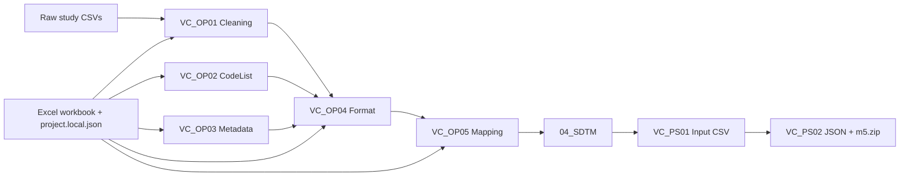

<p align="center">
  
</p>

<h1 align="center">SDTM Mapping System</h1>

<p align="center">
  <strong>Config-driven clinical trial ETL for turning raw study exports into CDISC SDTM datasets and M5 submission packages.</strong>
</p>

<p align="center">
  This repository packages a reusable execution engine, a workbook-driven mapping model, and a runnable study snapshot for <code>ENSEMBLE</code>.
</p>

<p align="center">
  <a href="#online-preview">Online Preview</a> ·
  <a href="#core-idea">Core Idea</a> ·
  <a href="#how-it-works">How It Works</a> ·
  <a href="#quick-start">Quick Start</a> ·
  <a href="#repository-structure">Repository Structure</a>
</p>

<p align="center">
  
  
  
  
  
  
  
</p>

<p align="center">
  <a href="studySpecific/ENSEMBLE/ENSEMBLE_OperationConf.xlsx"></a>
  <a href="studySpecific/ENSEMBLE/04_SDTM/sdtm_dataset-20260325133511"></a>
  <a href="studySpecific/ENSEMBLE/06_Inputpackage/inputpackage_dataset-20260325133718/m5.zip"></a>
</p>

## Overview

`SDTM Mapping System` is a configuration-first clinical data processing pipeline. It reads study-specific raw CSV exports, combines them with an Excel mapping workbook plus local project settings, and produces standardized SDTM datasets together with an `m5.zip` package for downstream submission-oriented workflows. In the source code and module docstrings, the system still carries the internal codename `VAPORCONE`.

这个仓库真正想解决的问题，不是单次“把几张表对一下字段”，而是把经常变化的 study-specific 规则尽量抽离到 Excel 和 JSON 配置里，让 Python 代码稳定为可复用的执行引擎。新增研究时，重点不是重写整条流水线，而是补 `studySpecific/<STUDY_ID>/` 下的工作簿、原始数据和少量研究特定函数。

<p align="center">
  
</p>

## Online Preview

当前仓库没有单独部署的 Web Demo，但已经把可浏览的样例配置、样例输入和样例输出一起放进仓库，适合直接作为公开作品集展示。

- [Sample study workbook](studySpecific/ENSEMBLE/ENSEMBLE_OperationConf.xlsx)
- [Sample raw inputs](studySpecific/ENSEMBLE/01_RawData)
- [Sample formatted datasets](studySpecific/ENSEMBLE/03_Format/format_dataset-20260325133500)
- [Sample SDTM outputs](studySpecific/ENSEMBLE/04_SDTM/sdtm_dataset-20260325133511)
- [Sample input CSV package](studySpecific/ENSEMBLE/05_Inputfile/inputfile_dataset-20260325133708)
- [Sample final `m5.zip`](studySpecific/ENSEMBLE/06_Inputpackage/inputpackage_dataset-20260325133718/m5.zip)

Current `ENSEMBLE` snapshot produces these SDTM domains:

- `DM`
- `CM`
- `DS`
- `MI`
- `PR`
- `RS`
- `SS`
- `TU`

And these supplemental outputs:

- `SUPPCM`
- `SUPPDS`
- `SUPPRS`

## Core Idea

这个项目的核心思想可以概括为一句话：

> Keep the engine stable, move the study logic into configuration, and make every stage auditable.

| Problem | Approach in this repo | Why it matters |
| --- | --- | --- |
| Study rules change frequently | Put mapping definitions in `project.local.json` and `*_OperationConf.xlsx` | Onboard new studies without rewriting the pipeline core |
| Clinical data transformations are easy to make opaque | Split work into timestamped stages like `02_Cleaning`, `03_Format`, `04_SDTM` | Each run is inspectable and reproducible |
| Code-list and metadata logic can become scattered | Persist them through MySQL tables and views | Centralizes lookup logic and reduces duplicated transformation code |
| Silent dtype drift is risky in clinical ETL | Preserve string-first processing with explicit formatting boundaries | Avoids accidental coercion of subject IDs, dates, and coded values |
| Mapping at scale gets slow | Use vectorized pandas/numpy paths, cached CSV reads, temp-table strategies, and multi-process domain mapping | Keeps the pipeline usable on larger study exports |

## Suitable Scenarios

- Sponsor or CRO internal workflows that need a practical path from raw study exports to SDTM-ready deliverables.
- Projects where mapping logic changes often and should be updated in a workbook instead of scattered across Python scripts.
- Teams that want stage-by-stage outputs for QA, diffing, validation, and operational traceability.
- Personal technical portfolios that want to show a serious, domain-aware ETL system rather than a toy data script.

## How It Works



## Architecture

| Layer | Main files | Responsibility |
| --- | --- | --- |
| Constants and paths | `VC_BC01_constant.py` | Load `project.local.json`, define paths, DB settings, sheet names, prefixes, and SDTM constants |
| Base utilities | `VC_BC02_baseUtils.py` | Logging, filesystem helpers, timestamped output directories, formatting helpers, and DB lifecycle management |
| Workbook parsing | `VC_BC03_fetchConfig.py` | Parse workbook sheets and fail fast on invalid mapping configuration |
| Mapping engine | `VC_BC04_operateType.py` and `VC_BC06_operateTypeFunctions.py` | Dispatch operation types, cache source CSVs, vectorize field mapping, and generate deterministic sequences |
| Processing stages | `VC_OP01_cleaning.py` to `VC_OP05_mapping.py` | Clean raw data, load codelists, load metadata, format records, and emit SDTM domains |
| Post-processing | `VC_PS01_makeInputCSV.py` and `VC_PS02_csv2json.py` | Rebuild input CSVs in required shape and generate the final M5 package |
| Study-specific extension points | `studySpecific/<STUDY_ID>/VC_BC05_studyFunctions.py` | Add study-level joins, derivations, refactoring helpers, and combine logic |

Supported operation types in the current engine:

- `DEF`
- `FIX`
- `FLG`
- `IIF`
- `COB`
- `CDL`
- `PRF`
- `SEL`

## Configuration Model

The repository is built around two configuration surfaces:

1. `project.local.json`
2. `studySpecific/<STUDY_ID>/<STUDY_ID>_OperationConf.xlsx`

`project.local.json` binds the execution environment to a specific study, root path, raw data location, and table/view names:

```json
{
  "STUDY_ID": "ENSEMBLE",
  "CODELIST_TABLE_NAME": "VC05_ENSEMBLE_CODELIST",
  "METADATA_TABLE_NAME": "VC05_ENSEMBLE_METADATA",
  "TRANSDATA_VIEW_NAME": "VC05_ENSEMBLE_TRANSDATA",
  "M5_PROJECT_NAME": "ENSEMBLE",
  "ROOT_PATH": "C:\\Local\\iTMS\\SDTM_ENSEMBLE",
  "RAW_DATA_ROOT_PATH": "C:\\Local\\iTMS\\SDTM_ENSEMBLE\\studySpecific\\ENSEMBLE\\01_RawData"
}
```

The Excel workbook acts as the study mapping DSL:

| Workbook sheet | Purpose |
| --- | --- |
| `SheetSetting` | Declares column layout, start rows, and sheet parsing rules |
| `Patients` | Maps `SUBJID` to `USUBJID` and controls migration flags |
| `Files` | Declares raw file metadata, title/data rows, and subject ID fields |
| `Process` | Defines field-level extraction, checks, translation behavior, and extra details logic |
| `CodeList` | Stores code-list lookup values used during translation |
| `Mapping` | Defines target SDTM domains, variables, merge rules, operation types, and parameters |
| `DomainsSetting` | Controls sort keys and domain-level sequence behavior |
| `Refactoring` and `Combine` | Optional hooks into study-specific Python functions |

This separation is the main reason the repo scales beyond a single one-off migration script.

## Engineering Highlights

- String-first dataframe handling keeps raw clinical identifiers and coded values stable until the formatting boundary.
- `MappingConfigurationError` pushes workbook problems to fail-fast validation instead of silent bad outputs.
- Timestamped stage folders preserve complete run history and make regression checks easier.
- `VC_OP04_format.py` includes toggles for temp tables, indexes, empty-column scanning, and query analysis.
- `VC_OP05_mapping.py` uses vectorized mapping plus `ProcessPoolExecutor` to parallelize by SDTM domain.
- Study-specific logic is isolated under `studySpecific/<STUDY_ID>/VC_BC05_studyFunctions.py` instead of leaking into the core engine.

## Quick Start

### 1. Set up the environment

```bash
python -m venv .venv
.venv\Scripts\Activate.ps1
pip install -r requirements.txt
python -c "import pandas,numpy,mysql.connector,openpyxl,dateutil; print('deps ok')"
```

### 2. Configure the local study binding

Create or update `project.local.json` in the repository root. You can also override the path with the `PROJECT_CONFIG_PATH` environment variable.

### 3. Prepare MySQL

```sql
CREATE DATABASE IF NOT EXISTS `VC-DataMigration_2.0`
CHARACTER SET utf8mb4
COLLATE utf8mb4_general_ci;
```

Default connection values live in `VC_BC01_constant.py`:

- `DB_HOST = 127.0.0.1`
- `DB_USER = root`
- `DB_PASSWORD = root`
- `DB_DATABASE = VC-DataMigration_2.0`

### 4. Run the full pipeline

```bash
python VC_OP01_cleaning.py
python VC_OP02_insertCodeList.py
python VC_OP03_insertMetadata.py
python VC_OP04_format.py
python VC_OP05_mapping.py
python VC_PS01_makeInputCSV.py
python VC_PS02_csv2json.py
```

### 5. Run a single stage while developing

```bash
python VC_OP04_format.py
```

## Output Contract

| Stage | Output path pattern | Notes |
| --- | --- | --- |
| Cleaning | `studySpecific/<STUDY>/02_Cleaning/cleaning_dataset-[timestamp]/` | Emits `C-`, `DC-`, and `DR-` prefixed CSVs |
| Formatting | `studySpecific/<STUDY>/03_Format/format_dataset-[timestamp]/` | Emits `F-*.csv` formatted source datasets |
| SDTM | `studySpecific/<STUDY>/04_SDTM/sdtm_dataset-[timestamp]/` | Emits final SDTM domain CSVs |
| Input CSV | `studySpecific/<STUDY>/05_Inputfile/inputfile_dataset-[timestamp]/` | Rebuilds main datasets and `SUPP*.csv` files |
| Input package | `studySpecific/<STUDY>/06_Inputpackage/inputpackage_dataset-[timestamp]/` | Emits `m5.zip` and unpacked JSON structure |

The current repository already contains three study folders:

- `CIRCULATE`
- `COSMOS_GC`
- `ENSEMBLE`

That structure shows how the same engine can be rebound to different studies over time.

## Repository Structure

```text
SDTM_ENSEMBLE/
├── project.local.json
├── requirements.txt
├── VC_BC01_constant.py
├── VC_BC02_baseUtils.py
├── VC_BC03_fetchConfig.py
├── VC_BC04_operateType.py
├── VC_BC06_operateTypeFunctions.py
├── VC_OP01_cleaning.py
├── VC_OP02_insertCodeList.py
├── VC_OP03_insertMetadata.py
├── VC_OP04_format.py
├── VC_OP05_mapping.py
├── VC_PS01_makeInputCSV.py
├── VC_PS02_csv2json.py
├── docs/
│   └── assets/
│       ├── hero.svg
│       └── preview.svg
└── studySpecific/
    ├── CIRCULATE/
    ├── COSMOS_GC/
    └── ENSEMBLE/
        ├── ENSEMBLE_OperationConf.xlsx
        ├── 01_RawData/
        ├── 02_Cleaning/
        ├── 03_Format/
        ├── 04_SDTM/
        ├── 05_Inputfile/
        ├── 06_Inputpackage/
        └── VC_BC05_studyFunctions.py
```

## Why This Repository Is Worth Showing

From a software engineering perspective, the interesting part is not that it reads CSVs. The interesting part is that it turns domain-heavy, easy-to-break clinical mapping work into a maintainable system design:

- configuration surfaces are explicit
- operational stages are inspectable
- study-specific overrides stay localized
- the output contract is stable
- performance work is built into the pipeline instead of bolted on later

If you want a repository homepage that communicates practical engineering value, this project is best understood as a reusable clinical ETL engine with configuration as its control plane.
