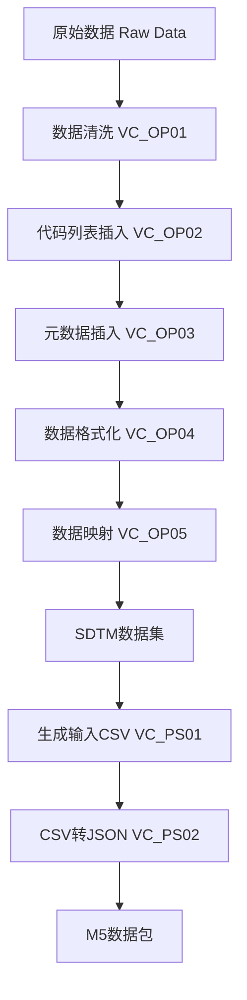

# VAPORCONE Clinical Data Processing System

## 项目概述

VAPORCONE 是一个专门用于临床试验数据处理和迁移的系统，主要功能是将原始的临床试验数据（Raw Data）转换为符合 CDISC SDTM（Study Data Tabulation Model）标准的数据格式，并最终生成可用于监管提交的 M5 数据包。

## 项目架构

```
VAPORCONE/
├── 基础模块 (BC - Base Components)
│   ├── VC_BC01_constant.py           # 常量定义与配置加载
│   ├── VC_BC02_baseUtils.py          # 基础工具函数
│   ├── VC_BC03_fetchConfig.py        # 配置文件读取
│   ├── VC_BC04_operateType.py        # 数据类型操作调度
│   ├── VC_BC05_studyFunctions.py     # 研究特定函数
│   └── VC_BC06_operateTypeFunctions.py # 操作类型具体实现函数
├── 操作模块 (OP - Operations)
│   ├── VC_OP01_cleaning.py           # 数据清洗
│   ├── VC_OP02_insertCodeList.py     # 代码列表插入
│   ├── VC_OP03_insertMetadata.py     # 元数据插入
│   ├── VC_OP04_format.py             # 数据格式化
│   ├── VC_OP05_mapping.py            # 数据映射
│   └── VC_OP06_combine.py            # 数据合并(实验性)
├── 后处理模块 (PS - Post Processing)
│   ├── VC_PS01_makeInputCSV.py       # 生成输入CSV
│   └── VC_PS02_csv2json.py           # CSV转JSON数据包
├── 配置文件
│   ├── project.local.json            # 本地项目配置文件
│   └── requirements.txt              # 项目依赖
├── 研究特定配置
│   ├── studySpecific/CIRCULATE/      # CIRCULATE研究配置
│   └── studySpecific/COSMOS_GC/      # COSMOS_GC研究配置
└── 实验性功能
    └── experiment/combine_test/      # 数据合并测试
```

## 核心功能模块

### 1. 基础模块 (BC - Base Components)

#### VC_BC01_constant.py
- **功能**: 定义项目全局常量及加载本地配置
- **主要内容**:
  - 加载 `project.local.json` 配置
  - 数据库连接参数
  - SDTM标准字段定义
  - 文件扩展名和前缀定义

#### VC_BC02_baseUtils.py
- **功能**: 提供基础工具函数
- **主要功能**:
  - 日志记录器创建
  - 数据库连接管理
  - 目录创建和文件操作
  - 数据处理工具函数

#### VC_BC03_fetchConfig.py
- **功能**: 从Excel配置文件读取配置信息
- **主要功能**:
  - 读取各类配置工作表 (SheetSetting, Case, File, Process, etc.)

#### VC_BC04_operateType.py
- **功能**: 数据类型操作调度
- **主要功能**:
  - 协调数据转换流程
  - 调用 `VC_BC06` 中的具体实现函数

#### VC_BC06_operateTypeFunctions.py
- **功能**: 操作类型具体实现
- **主要功能**:
  - 实现各种映射逻辑 (DEF, FIX, FLG, IIF, COB, CDL, PRF, SEL 等)
  - 模块化处理不同类型的字段转换

### 2. 操作模块 (OP - Operations)

#### VC_OP01_cleaning.py
- **功能**: 原始数据清洗
- **处理流程**:
  1. 根据配置筛选需要迁移的数据
  2. 分离迁移和非迁移的列
  3. 处理空白行和无效数据
  4. 输出清洗后的数据文件 (`C_`, `DC_`, `DR_` 前缀文件)

#### VC_OP02_insertCodeList.py
- **功能**: 代码列表数据库插入
- **处理流程**:
  1. 读取配置文件中的代码列表
  2. 创建并填充代码列表数据库表

#### VC_OP03_insertMetadata.py
- **功能**: 元数据插入到数据库
- **处理流程**:
  1. 读取字段映射配置
  2. 创建并填充元数据表

#### VC_OP04_format.py
- **功能**: 数据格式化处理
- **处理流程**:
  1. 应用数据类型转换
  2. 格式化日期时间字段
  3. 处理特殊值和编码

#### VC_OP05_mapping.py
- **功能**: 数据字段映射
- **处理流程**:
  1. 根据配置进行字段重命名
  2. 应用代码列表映射
  3. 计算派生字段
  4. 生成最终的SDTM数据集

### 3. 后处理模块 (PS - Post Processing)

#### VC_PS01_makeInputCSV.py
- **功能**: 生成输入CSV文件
- **处理流程**:
  1. 读取 `04_SDTM` 下最新的 `sdtm_dataset-[timestamp]`
  2. 按输入SDTM文件原始表头顺序生成主数据文件
  3. 分离补充字段并生成补充数据文件(SUPP)
  4. 输出到 `05_Inputfile/inputfile_dataset-[timestamp]/`

#### VC_PS02_csv2json.py
- **功能**: CSV转JSON数据包
- **处理流程**:
  1. 读取 `05_Inputfile` 下最新的 `inputfile_dataset-[timestamp]`
  2. 构建JSON数据结构
  3. 输出到 `06_Inputpackage/inputpackage_dataset-[timestamp]/`
  4. 生成M5格式的数据包 (ZIP压缩)

## 数据处理流程



## 安装和配置

### 系统要求

- **Python版本**: 3.11.0 或更高版本
- **数据库**: MySQL 5.7+ 或 MySQL 8.0+
- **操作系统**: Windows 10/11, Linux, macOS

### 1. 环境设置

#### 1.1 创建虚拟环境

```bash
# 创建虚拟环境
python -m venv venv

# 激活虚拟环境 (Windows)
venv\Scripts\activate

# 激活虚拟环境 (Linux/Mac)
source venv/bin/activate
```

#### 1.2 安装依赖

```bash
# 安装项目依赖
pip install -r requirements.txt
```

**依赖包列表**:
- `mysql-connector-python==9.4.0` - MySQL数据库连接
- `pandas==2.3.1` - 数据处理
- `numpy==2.2.6` - 数值计算
- `openpyxl==3.1.5` - Excel文件处理
- `python-dateutil==2.9.0` - 日期时间处理

#### 1.3 验证安装

```bash
# 验证Python版本
python --version  # 应显示 Python 3.11.0 或更高

# 验证依赖安装
python -c "import pandas, numpy, mysql.connector, openpyxl; print('所有依赖已安装')"
```

### 2. 项目配置 (推荐)
项目使用 `project.local.json` 进行本地配置。请在项目根目录创建该文件（可参考 `project.local.json` 示例），并配置以下内容：

```json
{
  "STUDY_ID": "COSMOS_GC",
  "CODELIST_TABLE_NAME": "VC05_COSMOS_GC_CODELIST",
  "METADATA_TABLE_NAME": "VC05_COSMOS_GC_METADATA",
  "TRANSDATA_VIEW_NAME": "VC05_COSMOS_GC_TRANSDATA",
  "M5_PROJECT_NAME": "[UAT]COSMOS_GC",
  "ROOT_PATH": "C:\\Local\\iTMS\\SDTM_COSMOS_GC",
  "RAW_DATA_ROOT_PATH": "C:\\Local\\iTMS\\SDTM_COSMOS_GC\\studySpecific\\COSMOS_GC\\RawData"
}
```
*注意：路径中的反斜杠 `\` 需要转义为 `\\`。*

### 3. 数据库配置

#### 3.1 数据库设置
确保MySQL服务已启动，并创建数据库（如果不存在，系统会自动创建）：
```sql
CREATE DATABASE IF NOT EXISTS `VC-DataMigration_2.0` CHARACTER SET utf8mb4 COLLATE utf8mb4_general_ci;
```

#### 3.2 连接参数配置
在 `VC_BC01_constant.py` 中配置数据库连接参数（如果未在环境变量中设置）：
```python
DB_HOST = '127.0.0.1'
DB_USER = 'root'
DB_PASSWORD = 'root'
DB_DATABASE = 'VC-DataMigration_2.0'
```

**注意**: 生产环境中建议使用环境变量或配置文件管理敏感信息，不要将密码硬编码在代码中。

### 4. 开发环境设置

#### 4.1 IDE配置
推荐使用支持Python的IDE，如：
- **PyCharm**: 推荐使用专业版
- **VS Code**: 安装Python扩展
- **Jupyter Notebook**: 用于数据探索和调试

#### 4.2 代码格式化工具
项目遵循PEP 8编码规范，建议安装以下工具：
```bash
# 安装代码格式化工具
pip install black flake8 isort

# 格式化代码
black *.py

# 检查代码风格
flake8 *.py

# 排序导入
isort *.py
```

#### 4.3 调试配置
- 启用日志记录：日志文件位于 `studySpecific/[STUDY_ID]/log_file.log`
- 性能监控：在 `VC_OP04_format.py` 中设置 `ENABLE_PERFORMANCE_MONITORING = True`
- 数据库查询分析：使用 `DatabaseManager.analyze_query_performance()` 分析查询性能

## 使用方法

### 标准处理流程

1. **数据清洗**
```bash
python VC_OP01_cleaning.py
```

2. **插入代码列表**
```bash
python VC_OP02_insertCodeList.py
```

3. **插入元数据**
```bash
python VC_OP03_insertMetadata.py
```

4. **数据格式化**
```bash
python VC_OP04_format.py
```

5. **数据映射**
```bash
python VC_OP05_mapping.py
```

6. **生成输入CSV**
```bash
python VC_PS01_makeInputCSV.py
```

7. **生成JSON数据包**
```bash
python VC_PS02_csv2json.py
```

### 配置文件

项目使用Excel配置文件来定义数据处理规则，配置文件应包含以下工作表:
- **SheetSetting**: 工作表配置
- **Case**: 病例信息
- **File**: 文件配置
- **Process**: 字段处理配置
- **CodeList**: 代码列表
- **Domain**: 域设置
- **Sites**: 站点信息

## 输出结构

```
studySpecific/[STUDY_ID]/
├── 02_Cleaning/                # 清洗数据
│   ├── cleaning_dataset-[timestamp]/
│   ├── deletedCols/            # 删除的列
│   └── deletedRows/            # 删除的行
├── 03_Format/                  # 格式化数据
│   └── format_dataset-[timestamp]/
├── 04_SDTM/                   # SDTM数据集
│   └── sdtm_dataset-[timestamp]/
├── 05_Inputfile/              # 输入CSV文件
│   └── inputfile_dataset-[timestamp]/
├── 06_Inputpackage/           # JSON数据包
│   └── inputpackage_dataset-[timestamp]/
│       ├── m5/
│       └── m5.zip
└── 08_Validation/             # 验证数据
```

### PS阶段补充说明

- `VC_PS01_makeInputCSV.py` 的主CSV字段顺序与输入SDTM文件保持一致；仅额外追加 `PAGEID`、`RECORDID`。
- `SUPP*.csv` 会为每个非标准字段逐行输出记录，`QVAL=''` 的空字符串也会保留，不再跳过。

## 模块依赖关系

### 依赖层次结构

```
VC_BC01_constant.py (基础常量)
    ↓
VC_BC02_baseUtils.py (工具函数)
    ↓
VC_BC03_fetchConfig.py (配置读取)
    ↓
VC_BC04_operateType.py (操作调度)
    ├── VC_BC05_studyFunctions.py (研究特定函数)
    └── VC_BC06_operateTypeFunctions.py (操作实现)
        ↓
VC_OP01_cleaning.py (数据清洗)
    ↓
VC_OP02_insertCodeList.py (代码列表)
    ↓
VC_OP03_insertMetadata.py (元数据)
    ↓
VC_OP04_format.py (格式化)
    ↓
VC_OP05_mapping.py (映射)
    ↓
VC_PS01_makeInputCSV.py (生成CSV)
    ↓
VC_PS02_csv2json.py (生成JSON)
```

### 模块调用说明

- **基础模块 (BC)**: 提供底层功能，被所有其他模块依赖
- **操作模块 (OP)**: 按顺序执行，每个模块依赖前一个模块的输出
- **后处理模块 (PS)**: 依赖操作模块的最终输出
- **研究特定函数**: 通过 `sys.path.append()` 动态导入，在 `VC_BC04_operateType.py` 中使用

## 研究特定配置

当前支持的研究:
- **CIRCULATE**: 循环系统研究
  - 配置文件: `studySpecific/CIRCULATE/CIRCULATE_OperationConf.xlsx`
  - 研究特定函数: `studySpecific/CIRCULATE/VC_BC05_studyFunctions.py`
- **COSMOS_GC**: COSMOS GC研究
  - 配置文件: `studySpecific/COSMOS_GC/COSMOS_GC_OperationConf.xlsx`
  - 研究特定函数: `studySpecific/COSMOS_GC/VC_BC05_studyFunctions.py`

## 故障排除

### 常见问题

#### 1. 数据库连接失败

**错误信息**: `Error: Access denied` 或 `Database does not exist`

**解决方案**:
- 检查MySQL服务是否启动
  ```bash
  # Windows
  net start MySQL
  
  # Linux/Mac
  sudo systemctl start mysql
  ```
- 验证连接参数配置（`VC_BC01_constant.py`）
- 确认数据库用户权限
- 检查防火墙设置
- 如果数据库不存在，系统会自动创建（需要相应权限）

#### 2. 路径错误

**错误信息**: `FileNotFoundError` 或路径相关错误

**解决方案**:
- 检查 `project.local.json` 中的路径配置
- 确认路径分隔符是否正确转义（Windows使用 `\\`）
- 验证路径是否存在且有读写权限
- 检查 `RAW_DATA_ROOT_PATH` 是否指向正确的原始数据目录

#### 3. 配置文件格式错误

**错误信息**: `MappingConfigurationError` 或工作表读取错误

**解决方案**:
- 检查Excel文件格式（.xlsx格式）
- 验证工作表名称是否完全匹配（区分大小写）
  - SheetSetting, Patients, Files, Process, CodeList, Mapping, DomainsSetting, Sites
- 确认必需字段存在且不为空
- 检查Mapping工作表中的Definition和Domain列
- 验证字段名和操作类型是否正确

#### 4. 内存不足

**错误信息**: `MemoryError` 或系统变慢

**解决方案**:
- 启用性能优化选项（`VC_OP04_format.py`）
  - `USE_TEMP_TABLES = True`
  - `ENABLE_WORK_TABLE_PERSISTENCE = True`
- 分批处理大文件
- 增加系统内存或使用更强大的服务器
- 清理旧的输出文件夹

#### 5. 编码错误

**错误信息**: `UnicodeDecodeError` 或乱码

**解决方案**:
- 确保所有CSV文件使用UTF-8编码（带BOM时使用utf-8-sig）
- 检查Excel文件编码
- 验证数据库字符集为utf8mb4

#### 6. 操作类型错误

**错误信息**: `KeyError` 或 `NameError: name 'opertype_XXX' is not defined`

**解决方案**:
- 检查操作类型名称是否正确（DEF, FIX, FLG, IIF, COB, CDL, PRF, SEL）
- 验证 `VC_BC06_operateTypeFunctions.py` 中是否实现了对应的操作类型函数
- 检查Excel配置中的操作类型拼写

#### 7. 序号生成错误

**错误信息**: 序号不连续或重复

**解决方案**:
- 检查排序键配置（DomainsSetting工作表）
- 验证USUBJID字段是否正确
- 检查 `sequenceDict` 的初始化

### 错误代码参考

| 错误类型 | 可能原因 | 检查位置 |
|---------|---------|---------|
| `MappingConfigurationError` | Excel配置错误 | Mapping工作表 |
| `mysql.connector.Error` | 数据库连接问题 | `VC_BC01_constant.py` |
| `FileNotFoundError` | 文件路径错误 | `project.local.json` |
| `KeyError` | 字段名错误 | Process/Mapping工作表 |
| `ValueError` | 数据类型错误 | 数据文件或配置 |
| `MemoryError` | 内存不足 | 系统资源 |

### 日志文件

- **系统日志**: `studySpecific/[STUDY_ID]/log_file.log`
  - 记录所有模块的执行日志
  - 包含错误和警告信息
- **性能日志**: 在 `VC_OP04_format.py` 中启用性能监控后输出
- **数据库日志**: MySQL错误日志（取决于MySQL配置）

### 调试技巧

1. **启用详细日志**:
   ```python
   logger = create_logger(log_file, log_level=logging.DEBUG)
   ```

2. **检查中间输出**:
   - 清洗数据: `02_Cleaning/cleaning_dataset-[timestamp]/`
   - 格式化数据: `03_Format/format_dataset-[timestamp]/`
   - SDTM数据: `04_SDTM/sdtm_dataset-[timestamp]/`
   - 输入CSV: `05_Inputfile/inputfile_dataset-[timestamp]/`
   - 输入包: `06_Inputpackage/inputpackage_dataset-[timestamp]/`

3. **使用性能分析**:
   - 在 `VC_OP04_format.py` 中设置 `ENABLE_EXPLAIN_ANALYSIS = True`
   - 查看数据库查询执行计划

4. **验证配置**:
   - 使用Python交互式环境测试配置读取
   - 检查数据库表结构是否正确创建

## 开发规范

### 文件命名规范
- `VC_BC##_`: 基础组件模块
- `VC_OP##_`: 操作处理模块  
- `VC_PS##_`: 后处理模块

### 代码规范
- 使用中文注释和文档字符串
- 遵循PEP 8编码规范

## 版本信息

- **当前版本**: 2.1
- **Python版本**: 3.11.0（必需）
- **最后更新**: 2025年

## 相关文档

- **Agent知识库**: 查看 `AGENT_KNOWLEDGE.md` 获取详细的模块说明、快速索引和开发指南
- **项目配置文件**: `project.local.json` - 本地项目配置
- **依赖文件**: `requirements.txt` - Python依赖包列表

## 许可证

本项目为内部使用项目，请遵守公司相关规定。

## 技术支持

如遇到问题，请：
1. 查看本文档的"故障排除"部分
2. 检查日志文件获取详细错误信息
3. 参考 `AGENT_KNOWLEDGE.md` 获取技术细节
4. 联系项目开发团队
