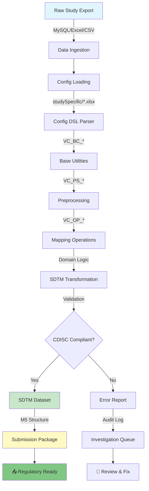

[English](README.md) | [中文](README_CN.md)

<div align="center">

```svg
<svg viewBox="0 0 800 120" xmlns="http://www.w3.org/2000/svg">
  <defs>
    <linearGradient id="grad1" x1="0%" y1="0%" x2="100%" y2="0%">
      <stop offset="0%" style="stop-color:#667eea;stop-opacity:1" />
      <stop offset="100%" style="stop-color:#764ba2;stop-opacity:1" />
    </linearGradient>
  </defs>
  <rect width="800" height="120" fill="url(#grad1)" rx="10"/>
  <text x="400" y="70" font-size="48" font-weight="bold" fill="white" text-anchor="middle" font-family="monospace">
    SDTM Mapping System
  </text>
  <text x="400" y="105" font-size="16" fill="#f0f0f0" text-anchor="middle" font-family="sans-serif">
    Clinical Trial ETL • CDISC SDTM • Config-Driven
  </text>
</svg>
```


**Transform raw clinical study data into standardized CDISC SDTM datasets and M5 submission packages using declarative Excel configuration.**

[Features](#features) • [Architecture](#architecture) • [Quick Start](#quick-start) • [Configuration](#configuration) • [Contributing](#contributing)

</div>

---

## Overview

SDTM Mapping System (codename: **VAPORCONE**) is a production-grade, config-driven ETL pipeline for clinical trial data standardization. It transforms raw study exports into CDISC SDTM-compliant datasets and regulatory M5 submission packages.

**Why SDTM Mapping System?**
- 📋 **Config as Code**: Excel workbook acts as a "configuration DSL" – no Python coding required for study-specific mappings
- 🔄 **Modular Pipeline**: Cleanly separated base utilities (VC_BC*), operations (VC_OP*), and preprocessing (VC_PS*)
- 📊 **Production Ready**: Built for enterprise clinical trial workflows with CDISC compliance
- 🗄️ **Multi-Source**: Seamless integration with MySQL, Excel, and other study export formats
- 🎯 **Study Isolation**: Per-study configuration in `studySpecific/` directory ensures reproducibility and auditability

---

## Key Features

| Feature | Description |
|---------|-------------|
| 🎛️ **Excel-Driven Configuration** | Define entire mapping logic in human-readable Excel workbooks |
| 🔗 **CDISC SDTM Compliance** | Auto-validates against SDTM IG standards |
| 📦 **M5 Package Generation** | Direct regulatory submission package creation |
| 🔀 **Complex ETL Workflows** | Preprocessing, transformation, validation in one pipeline |
| 💾 **Multi-Database Support** | MySQL, Excel, CSV, Parquet integration |
| 📈 **Audit Trail** | Full traceability from source to SDTM dataset |
| ⚡ **Vectorized Operations** | Leverages pandas/numpy for performance at scale |
| 🎨 **Visual Pipeline Inspection** | Preview SVG diagrams of data flow (docs/assets/) |

---

## Architecture



### Module Organization

```
SDTM-Mapping-System/
├── VC_BC_*.py              # Base classes & utilities
├── VC_OP_*.py              # Mapping operations
├── VC_PS_*.py              # Preprocessing modules
├── main.py                 # Pipeline orchestrator
├── config.toml             # Global configuration
├── studySpecific/          # Per-study configs
│   ├── STUDY001/
│   │   ├── mapping.xlsx    # Study mapping DSL
│   │   └── rules.json      # Custom business logic
│   └── STUDY002/
│       └── mapping.xlsx
├── docs/
│   ├── assets/
│   │   ├── hero.svg        # Architecture diagram
│   │   └── preview.svg     # Data flow visualization
│   └── MAPPING_GUIDE.md    # Configuration reference
└── tests/                  # Unit & integration tests
```

---

## Quick Start

### Prerequisites

- **Python 3.11+**
- **pip** or **conda**
- MySQL database (optional, CSV/Excel also supported)

### Installation

```bash
# Clone the repository
git clone https://github.com/hakupao/SDTM-Mapping-System.git
cd SDTM-Mapping-System

# Install dependencies
pip install -r requirements.txt

# Verify installation
python -c "import VC_BC; print('✓ Installation successful')"
```

### Your First SDTM Mapping (5 minutes)

```bash
# 1. Prepare raw data
cp /path/to/study_export.xlsx data/raw/

# 2. Create study config
cp studySpecific/TEMPLATE/mapping.xlsx studySpecific/MY_STUDY/mapping.xlsx
# Edit the Excel file with your domain mappings

# 3. Run the pipeline
python main.py --study MY_STUDY --output ./output/

# 4. Review SDTM datasets
ls output/MY_STUDY/sdtm/
# dm.xlsx, ae.xlsx, ev.xlsx, ...
```

---

## Configuration

### Excel Config DSL

The magic happens in `studySpecific/YOUR_STUDY/mapping.xlsx`:

| Sheet | Purpose | Example |
|-------|---------|---------|
| **DataSources** | Raw data locations | `SOURCE_PATH: C:/data/export.csv` |
| **Demographics** | DM domain mapping | `SOURCE.PatientID → SDTM.USUBJID` |
| **Adverse Events** | AE domain mapping | `SOURCE.AdverseEvent → SDTM.AEDECOD` |
| **Lab** | LB domain mapping | Measurements, results, dates |
| **Vital Signs** | VS domain mapping | Blood pressure, heart rate, temperature |
| **Validation Rules** | Business logic | Custom checks, expected ranges |
| **Terminology** | SDTM codelist mappings | ICD10 → MedDRA conversions |

#### Example: Demographics Mapping

```
SOURCE COLUMN    | SDTM COLUMN | TRANSFORMATION | REQUIRED
PatientID        | USUBJID     | Prepend site    | ✓
Sex              | SEX         | M→M, F→F        | ✓
DOB              | BRTHDTC     | ISO 8601 date   | ✓
Status           | ACTARMCD    | Active→ACTIVE   | ✓
```

### Main Configuration (config.toml)

```toml
[pipeline]
log_level = "INFO"
validate_cdisc = true
output_format = "xlsx"  # xlsx, sas, parquet

[database]
type = "mysql"
host = "localhost"
port = 3306
database = "clinical_data"

[m5_package]
enabled = true
submission_type = "IND"  # IND, BLA, NDA
sponsor_id = "1234567"
```

---

## Usage Examples

### Basic Pipeline Execution

```python
from VC_BC_core import Pipeline
from VC_PS_preprocessing import PreProcessor
from VC_OP_sdtm import SDTMTransformer

# Load configuration
config = Pipeline.load_config("studySpecific/MY_STUDY/mapping.xlsx")

# Initialize pipeline stages
prep = PreProcessor(config)
transformer = SDTMTransformer(config)

# Execute
raw_data = prep.load_raw_data()
clean_data = prep.execute()
sdtm_data = transformer.map_to_sdtm(clean_data)

# Validate & export
sdtm_data.validate()
sdtm_data.export_m5_package("./output/")
```

### Custom Preprocessing

```python
from VC_PS_preprocessing import PreProcessor

class CustomPreProcessor(PreProcessor):
    def handle_missing_values(self, df):
        # Study-specific logic
        return df.fillna(method='bfill')

processor = CustomPreProcessor(config)
data = processor.execute()
```

### Validation & QA

```python
from VC_OP_validation import Validator

validator = Validator(config)
report = validator.validate_sdtm_compliance(sdtm_data)

print(f"✓ Passed: {report.passed_checks}")
print(f"✗ Failed: {report.failed_checks}")
print(f"⚠ Warnings: {report.warnings}")

# Export audit trail
report.export_html("audit_report.html")
```

---

## Dependencies

| Package | Version | Purpose |
|---------|---------|---------|
| **pandas** | 2.3.1 | Data manipulation & transformation |
| **numpy** | 2.2.6 | Numerical operations |
| **openpyxl** | 3.1.5 | Excel configuration reading |
| **mysql-connector-python** | 9.4.0 | Database connectivity |
| **pydantic** | 2.0+ | Config validation |
| **lxml** | 4.9+ | XML/SAS7BDAT handling |
| **requests** | 2.28+ | API integration |

Install all dependencies:
```bash
pip install pandas==2.3.1 numpy==2.2.6 openpyxl==3.1.5 mysql-connector-python==9.4.0
```

---

## Project Structure

<details>
<summary><b>📁 Detailed File Organization</b></summary>

```
SDTM-Mapping-System/
│
├── 📄 README.md & README_CN.md
├── 📄 requirements.txt
├── 📄 config.toml
├── 📄 main.py                    # Entry point
│
├── 🔧 Base Utilities (VC_BC_*)
│   ├── VC_BC_core.py             # Pipeline orchestration
│   ├── VC_BC_config.py           # Configuration loader
│   ├── VC_BC_data.py             # Data structures
│   └── VC_BC_logger.py           # Logging & audit trail
│
├── 🔄 Preprocessing (VC_PS_*)
│   ├── VC_PS_preprocessing.py    # Main preprocessing
│   ├── VC_PS_cleaning.py         # Data cleaning
│   ├── VC_PS_validation.py       # Input validation
│   └── VC_PS_encoding.py         # Character encoding handling
│
├── 🗺️  Mapping Operations (VC_OP_*)
│   ├── VC_OP_sdtm.py             # SDTM transformation
│   ├── VC_OP_domains.py          # Domain-specific logic
│   ├── VC_OP_terminology.py      # Codelist mapping
│   └── VC_OP_validation.py       # CDISC validation
│
├── 📊 Study Configs
│   ├── studySpecific/
│   │   ├── TEMPLATE/
│   │   │   ├── mapping.xlsx
│   │   │   └── rules.json
│   │   ├── STUDY001/
│   │   │   └── mapping.xlsx
│   │   └── STUDY002/
│   │       └── mapping.xlsx
│
├── 📚 Documentation
│   ├── docs/
│   │   ├── MAPPING_GUIDE.md
│   │   ├── API_REFERENCE.md
│   │   ├── TROUBLESHOOTING.md
│   │   └── assets/
│   │       ├── hero.svg
│   │       └── preview.svg
│
└── ✅ Tests
    ├── tests/
    │   ├── test_bc_core.py
    │   ├── test_ps_preprocessing.py
    │   ├── test_op_sdtm.py
    │   └── test_integration.py
```

</details>

---

## Advanced Topics

<details>
<summary><b>🚀 Performance Tuning</b></summary>

### Vectorized Operations

```python
# ✓ Good: Vectorized
df['SDTM_VALUE'] = df['RAW_VALUE'].apply(transformation_func)

# ✗ Avoid: Row-by-row iteration
for idx, row in df.iterrows():
    df.at[idx, 'SDTM_VALUE'] = transform(row['RAW_VALUE'])
```

### Memory Optimization

```python
# Use dtypes efficiently
df['USUBJID'] = df['USUBJID'].astype('category')
df['SEX'] = df['SEX'].astype('category')

# Process in chunks for large datasets
for chunk in pd.read_csv('huge_file.csv', chunksize=10000):
    process_chunk(chunk)
```

### Parallel Processing

```python
from multiprocessing import Pool

def process_study(study_id):
    config = load_config(f"studySpecific/{study_id}/mapping.xlsx")
    return execute_pipeline(config)

with Pool(4) as p:
    results = p.map(process_study, ['STUDY001', 'STUDY002', ...])
```

</details>

<details>
<summary><b>🔐 Data Security & Compliance</b></summary>

- **Audit Trail**: All transformations logged with timestamps
- **De-identification**: Built-in masking for PHI (dates, names)
- **Encryption**: Optional field-level encryption for sensitive data
- **Access Control**: Study-level access policies via config
- **HIPAA Compliance**: Follows HIPAA Privacy Rule for data handling
- **Validation Checkpoints**: Mandatory validation gates before export

</details>

<details>
<summary><b>🐛 Troubleshooting</b></summary>

| Error | Cause | Solution |
|-------|-------|----------|
| `ConfigNotFoundError` | Missing mapping.xlsx | Verify path in config.toml |
| `DataValidationFailed` | Invalid source data | Review validation_report.html |
| `SDTMComplianceFailed` | CDISC rule violation | Check CDISC_errors.log |
| `DatabaseConnectionError` | MySQL connection issue | Verify credentials in config.toml |

View detailed logs:
```bash
tail -f logs/pipeline_$(date +%Y%m%d).log
```

</details>

---

## Contributing

Contributions welcome! Please read [CONTRIBUTING.md](CONTRIBUTING.md) first.

```bash
# Fork & clone
git clone https://github.com/YOUR_USERNAME/SDTM-Mapping-System.git
cd SDTM-Mapping-System

# Create feature branch
git checkout -b feature/my-improvement

# Make changes, add tests
pytest tests/

# Commit & push
git commit -m "feat: add new domain mapping support"
git push origin feature/my-improvement

# Create Pull Request
```

---

## Roadmap

- [ ] UI dashboard for mapping configuration
- [ ] Real-time validation feedback
- [ ] AI-powered terminology mapping suggestions
- [ ] Multi-study batch processing
- [ ] Cloud deployment templates (Docker, K8s)
- [ ] OpenAPI specification for pipeline APIs

---

## License

MIT License © 2024 hakupao

---

## Citation

If you use SDTM Mapping System in your research, please cite:

```bibtex
@software{vaporcone2024,
  author = {hakupao},
  title = {SDTM Mapping System: Clinical Trial ETL for CDISC Standardization},
  url = {https://github.com/hakupao/SDTM-Mapping-System},
  year = {2024}
}
```

---

## Contact & Support

- 📧 **Issues**: [GitHub Issues](https://github.com/hakupao/SDTM-Mapping-System/issues)
- 💬 **Discussions**: [GitHub Discussions](https://github.com/hakupao/SDTM-Mapping-System/discussions)
- 📖 **Documentation**: [docs/](docs/)

---

<div align="center">

**[⬆ Back to Top](#-sdtm-mapping-system)**

Made with ❤️ for clinical data professionals

</div>
