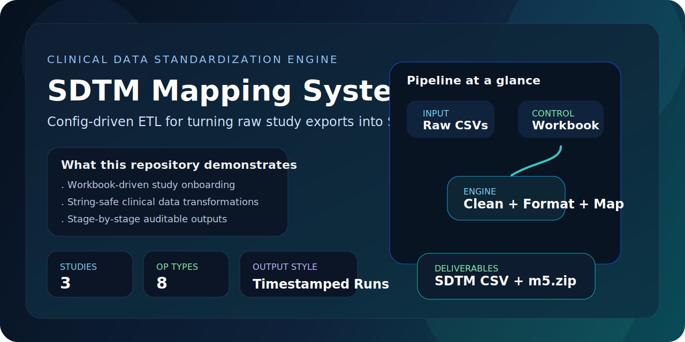
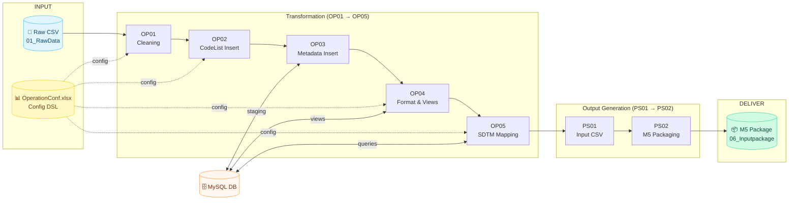
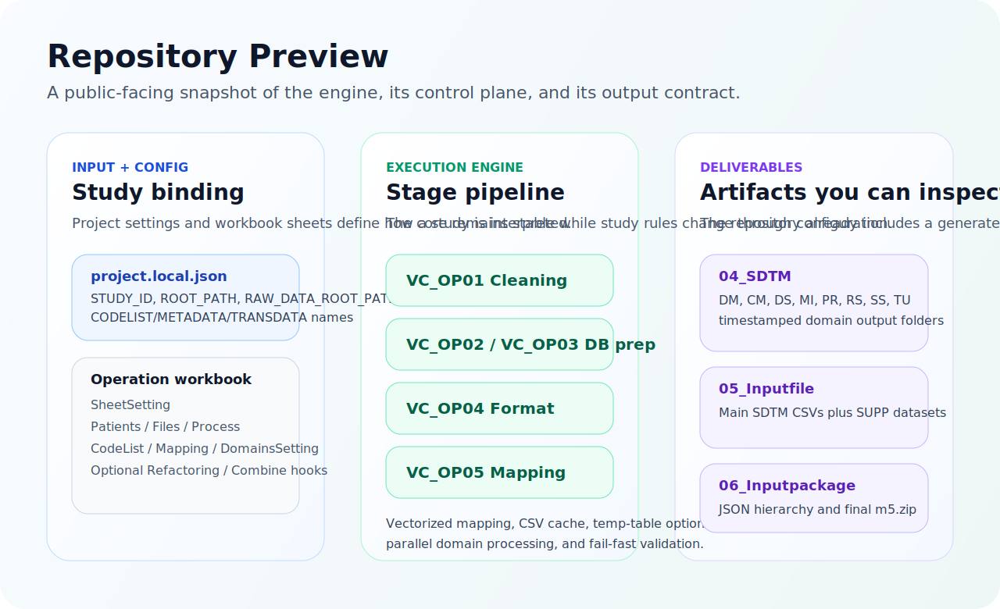
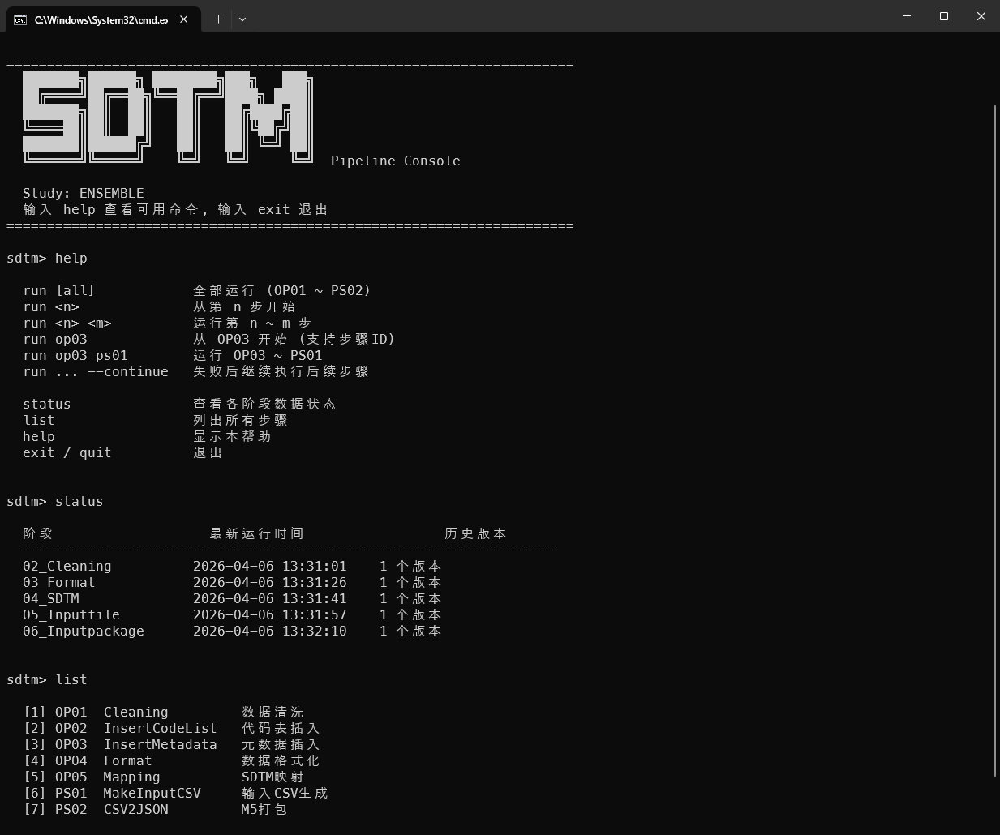

<div align="center">

[English](README.md) | [中文](README_CN.md)

<!-- Typing SVG -->
<a href="https://git.io/typing-svg">
  
</a>

<p><strong>Transform raw clinical study data into CDISC SDTM datasets and M5 submission packages<br/>through a 7-step automated pipeline driven entirely by Excel configuration.</strong></p>

<!-- Badge wall -->
[](https://python.org)
[](https://pandas.pydata.org)
[](https://numpy.org)
[](https://dev.mysql.com/doc/connector-python/en/)
[](https://www.cdisc.org/standards/foundational/sdtm)
[](LICENSE)
[]()

<br/>

<!-- Hero banner -->


<br/>

[Features](#-features) · [Architecture](#-architecture) · [Quick Start](#-quick-start) · [Pipeline](#-pipeline-steps) · [Configuration](#-configuration) · [CLI Reference](#-cli-reference)

</div>

---

## About

**SDTM Mapping System** (codename **VAPORCONE**) is a production-grade ETL pipeline for clinical trial data standardization. Define your mapping rules in an Excel workbook, point the pipeline at your raw study exports, and receive CDISC SDTM-compliant datasets plus a ready-to-submit M5 regulatory package — no Python coding required.

---

## ✨ Features

| | Feature | Description |
|---|---------|-------------|
| 📋 | **Excel-Driven Configuration** | Define entire mapping logic in `OperationConf.xlsx` — the workbook acts as a declarative DSL |
| 🔗 | **7-Step Automated Pipeline** | OP01~OP05 (transformation) + PS01~PS02 (output generation), each independently runnable |
| 💻 | **Interactive CLI Console** | Built-in `sdtm` command with run / status / list commands and execution summaries |
| ⚡ | **Batch Runner** | `run_pipeline.py` for non-interactive execution with `--continue` and `--dry-run` flags |
| 🗄️ | **MySQL Transformation Hub** | Staging tables, auto-created indexes, and optimized views for high-performance processing |
| 📦 | **M5 Submission Packaging** | Direct regulatory submission package creation (JSON + M5 directory structure) |
| 🕐 | **Timestamped Versioning** | Every pipeline run creates a timestamped output folder for full traceability and audit |
| 🌐 | **CJK-Aware Formatting** | Proper text alignment for Japanese / Chinese characters in console output |
| 🚀 | **Performance Optimized** | Vectorized pandas/numpy, multiprocessing, precomputed caching, batch DB inserts |

---

## 🏗️ Architecture

<details open>
<summary><b>Pipeline Flow (Mermaid)</b></summary>
<br/>



</details>

<br/>

<details>
<summary><b>Repository Preview</b></summary>
<br/>

<div align="center">

</div>

</details>

<br/>

### Module Organization

```
SDTM-Mapping-System/
│
├── 🔧 Base Classes & Utilities (VC_BC_*)
│   ├── VC_BC01_constant.py              # Project config, DB credentials, paths
│   ├── VC_BC02_baseUtils.py             # Logger, console formatting, DatabaseManager
│   ├── VC_BC03_fetchConfig.py           # Excel config parser & validation
│   ├── VC_BC04_operateType.py           # Data operations, table joins, CSV caching
│   └── VC_BC06_operateTypeFunctions.py  # Operation helper functions
│
├── ⚙️ Transformation Pipeline (VC_OP_*)
│   ├── VC_OP01_cleaning.py              # Step 1 — Raw data filtering & cleaning
│   ├── VC_OP02_insertCodeList.py        # Step 2 — Code list DB insertion
│   ├── VC_OP03_insertMetadata.py        # Step 3 — Metadata DB insertion
│   ├── VC_OP04_format.py                # Step 4 — Data formatting & view creation
│   └── VC_OP05_mapping.py               # Step 5 — SDTM domain mapping
│
├── 📦 Output Generation (VC_PS_*)
│   ├── VC_PS01_makeInputCSV.py          # Step 6 — Input CSV generation
│   └── VC_PS02_csv2json.py              # Step 7 — M5 package creation
│
├── 🚀 Pipeline Runners
│   ├── sdtm.py                          # Interactive CLI console
│   ├── sdtm.bat                         # Windows launcher
│   └── run_pipeline.py                  # Batch pipeline executor
│
├── 📝 Configuration
│   ├── project.local.json               # Study ID, DB table names, paths
│   └── requirements.txt                 # Python dependencies
│
└── 📂 studySpecific/                    # Per-study configuration & data
    ├── ENSEMBLE/
    │   ├── ENSEMBLE_OperationConf.xlsx   # Master config workbook (DSL)
    │   ├── VC_BC05_studyFunctions.py     # Study-specific custom logic
    │   ├── 01_RawData/                   # Raw CSV input files
    │   ├── 02_Cleaning/                  # Step 1 output (timestamped)
    │   ├── 03_Format/                    # Step 4 output (timestamped)
    │   ├── 04_SDTM/                      # Step 5 output (timestamped)
    │   ├── 05_Inputfile/                 # Step 6 output (timestamped)
    │   └── 06_Inputpackage/              # Step 7 output (M5 package)
    ├── CIRCULATE/
    └── COSMOS_GC/
```

<p align="right">(<a href="#about">back to top</a>)</p>

---

## 🚀 Quick Start

### Prerequisites

- **Python 3.11+**
- **MySQL** database server (running locally or remotely)
- **pip**

### Installation

```bash
# Clone the repository
git clone https://github.com/hakupao/SDTM-Mapping-System.git
cd SDTM-Mapping-System

# Install dependencies
pip install -r requirements.txt
```

### Configuration

Create or edit `project.local.json` in the project root:

```json
{
  "STUDY_ID": "ENSEMBLE",
  "CODELIST_TABLE_NAME": "VC05_ENSEMBLE_CODELIST",
  "METADATA_TABLE_NAME": "VC05_ENSEMBLE_METADATA",
  "TRANSDATA_VIEW_NAME": "VC05_ENSEMBLE_TRANSDATA",
  "M5_PROJECT_NAME": "ENSEMBLE",
  "ROOT_PATH": "C:\\Local\\iTMS\\SDTM_ENSEMBLE",
  "RAW_DATA_ROOT_PATH": "C:\\...\\studySpecific\\ENSEMBLE\\01_RawData"
}
```

### Run

```bash
# Launch the interactive console
python sdtm.py

# Or run the full pipeline directly
python run_pipeline.py
```

<p align="right">(<a href="#about">back to top</a>)</p>

---

## 🔄 Pipeline Steps

| # | Module | Step ID | Name | What It Does |
|:-:|--------|:-------:|------|-------------|
| 1 | `VC_OP01_cleaning` | OP01 | **Cleaning** | Filter raw CSV by case dict, remove unmapped columns and invalid rows |
| 2 | `VC_OP02_insertCodeList` | OP02 | **InsertCodeList** | Insert code / terminology mappings into MySQL |
| 3 | `VC_OP03_insertMetadata` | OP03 | **InsertMetadata** | Parse cleaned data, format values, insert field metadata into MySQL |
| 4 | `VC_OP04_format` | OP04 | **Format** | Create optimized DB views with indexes, export formatted CSVs |
| 5 | `VC_OP05_mapping` | OP05 | **Mapping** | Apply SDTM domain transformations (DM, AE, LB, VS, etc.) via multiprocessing |
| 6 | `VC_PS01_makeInputCSV` | PS01 | **MakeInputCSV** | Split SDTM data into main domain CSVs + SUPP* companion files |
| 7 | `VC_PS02_csv2json` | PS02 | **CSV2JSON** | Generate M5 submission package (JSON + directory structure) |

<details>
<summary><b>Data Flow Diagram</b></summary>

```
01_RawData/  (raw CSV files)
    │  [OP01] Filter by case dict, clean columns
    ▼
02_Cleaning/cleaning_dataset-{YYYYMMDDHHMMSS}/
    │  [OP02] Code list  ──▶  MySQL CODELIST table
    │  [OP03] Metadata   ──▶  MySQL METADATA table
    ▼
MySQL: CODELIST + METADATA tables (with auto-created indexes)
    │  [OP04] Create TRANSDATA view, export formatted CSV
    ▼
03_Format/format_dataset-{YYYYMMDDHHMMSS}/
    │  [OP05] Apply SDTM domain mappings (parallel processing)
    ▼
04_SDTM/sdtm_dataset-{YYYYMMDDHHMMSS}/
    │  [PS01] Split into main domains + SUPP* files
    ▼
05_Inputfile/inputfile_dataset-{YYYYMMDDHHMMSS}/
    │  [PS02] Build M5 JSON package structure
    ▼
06_Inputpackage/inputpackage_dataset-{YYYYMMDDHHMMSS}/
    └── m5/m5/datasets/{STUDY}/tabulations/sdtm/
```

</details>

<p align="right">(<a href="#about">back to top</a>)</p>

---

## 💻 CLI Reference

<div align="center">

</div>

<br/>

### Interactive Console (`sdtm.py`)

```bash
python sdtm.py          # Enter interactive mode
sdtm                    # Windows shortcut (via sdtm.bat)
python sdtm.py run all  # One-shot: run and exit
```

| Command | Description |
|---------|-------------|
| `run all` | Run all 7 steps (OP01 ~ PS02) |
| `run <n>` | Run step n only |
| `run <n> <m>` | Run steps n through m |
| `run op03` | Run OP03 only (step IDs are case-insensitive) |
| `run op03 ps01` | Run by step ID (case-insensitive) |
| `run ... --continue` | Continue past failures |
| `status` | Show latest output timestamps and version counts |
| `list` | List all pipeline steps |
| `help` | Show available commands |
| `exit` | Quit the console |

### Batch Runner (`run_pipeline.py`)

```bash
python run_pipeline.py              # Run all 7 steps
python run_pipeline.py 3            # From step 3 onward
python run_pipeline.py 3 5          # Steps 3 to 5 only
python run_pipeline.py --continue   # Continue past failures
python run_pipeline.py --dry-run    # Preview execution plan without running
```

### Individual Steps

Each step module can be run standalone:

```bash
python VC_OP01_cleaning.py
python VC_OP05_mapping.py
python VC_PS02_csv2json.py
```

<p align="right">(<a href="#about">back to top</a>)</p>

---

## 📋 Configuration

### Excel Config DSL — `OperationConf.xlsx`

The master configuration workbook drives the entire pipeline. Each sheet controls a specific aspect:

| Sheet | Purpose |
|-------|---------|
| **SheetSetting** | Column configurations and starting row definitions for each sheet |
| **CaseList** | Patient ID mappings (SUBJID &#8594; USUBJID) and migration flags |
| **FileDict** | Raw data file definitions (filename, encoding, delimiters) |
| **FieldDict** | Field specifications, data types, and transformation rules |
| **CodeList** | Code / terminology value mappings |
| **Mapping** | SDTM domain transformation rules (DM, AE, LB, VS, EV, etc.) |
| **Combine** | Custom table join / combination definitions |

### Study-Specific Functions — `VC_BC05_studyFunctions.py`

For domain logic that cannot be expressed in the Excel DSL, each study defines custom Python functions:

```python
def DM():
    """Custom DM domain generation.

    Sources: RGST (registration), LSVDAT (last survival), OC (outcome)
    Computes: RFENDAT (end date), DTHFLG (death flag)
    """
    ...
```

### Project Settings — `project.local.json`

| Key | Description |
|-----|-------------|
| `STUDY_ID` | Active study identifier |
| `CODELIST_TABLE_NAME` | MySQL table for code list data |
| `METADATA_TABLE_NAME` | MySQL table for metadata |
| `TRANSDATA_VIEW_NAME` | MySQL view for formatted data |
| `M5_PROJECT_NAME` | Project name in M5 package output |
| `ROOT_PATH` | Absolute path to project root |
| `RAW_DATA_ROOT_PATH` | Absolute path to raw data directory |

<p align="right">(<a href="#about">back to top</a>)</p>

---

## 🛠️ Tech Stack


| Package | Version | Purpose |
|---------|:-------:|---------|
| **mysql-connector-python** | 9.4.0 | MySQL database connectivity |
| **pandas** | 2.3.1 | Data manipulation & transformation |
| **numpy** | 2.2.6 | Numerical operations |
| **openpyxl** | 3.1.5 | Excel workbook reading |
| **python-dateutil** | 2.9.0 | Date parsing & formatting |

```bash
pip install -r requirements.txt
```

<p align="right">(<a href="#about">back to top</a>)</p>

---

## 📄 License

Distributed under the MIT License. See [LICENSE](LICENSE) for more information.

---

## 📬 Contact & Support

- **Issues** — [GitHub Issues](https://github.com/hakupao/SDTM-Mapping-System/issues)
- **Discussions** — [GitHub Discussions](https://github.com/hakupao/SDTM-Mapping-System/discussions)

---

<div align="center">

**[⬆ Back to Top](#about)**

Made with care for clinical data professionals

<a href="https://github.com/hakupao/SDTM-Mapping-System/graphs/contributors">
  
</a>

</div>
