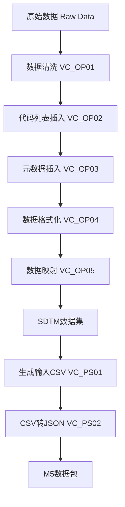

# VAPORCONE Clinical Data Processing System

## 项目概述

VAPORCONE 是一个专门用于临床试验数据处理和迁移的系统，主要功能是将原始的临床试验数据（Raw Data）转换为符合 CDISC SDTM（Study Data Tabulation Model）标准的数据格式，并最终生成可用于监管提交的 M5 数据包。

## 项目架构

```
VAPORCONE/
├── 基础模块 (BC - Base Components)
│   ├── VC_BC01_constant.py      # 常量定义
│   ├── VC_BC02_baseUtils.py     # 基础工具函数
│   ├── VC_BC03_fetchConfig.py   # 配置文件读取
│   ├── VC_BC04_operateType.py   # 数据类型操作
│   └── VC_BC05_studyFunctions.py # 研究特定函数
├── 操作模块 (OP - Operations)
│   ├── VC_OP01_cleaning.py      # 数据清洗
│   ├── VC_OP02_insertCodeList.py # 代码列表插入
│   ├── VC_OP03_insertMetadata.py # 元数据插入
│   ├── VC_OP04_format.py        # 数据格式化
│   ├── VC_OP05_mapping.py       # 数据映射
│   └── VC_OP06_combine.py       # 数据合并(实验性)
├── 后处理模块 (PS - Post Processing)
│   ├── VC_PS01_makeInputCSV.py  # 生成输入CSV
│   └── VC_PS02_csv2json.py      # CSV转JSON数据包
├── 研究特定配置
│   └── studySpecific/CIRCULATE/ # CIRCULATE研究配置
└── 实验性功能
    └── experiment/combine_test/ # 数据合并测试
```

## 核心功能模块

### 1. 基础模块 (BC - Base Components)

#### VC_BC01_constant.py
- **功能**: 定义项目全局常量
- **主要内容**:
  - 研究ID和数据库表名配置
  - 文件路径配置
  - 数据库连接参数
  - SDTM标准字段定义
  - 文件扩展名和前缀定义

#### VC_BC02_baseUtils.py
- **功能**: 提供基础工具函数
- **主要功能**:
  - 日志记录器创建
  - 数据库连接管理
  - 目录创建和文件操作
  - 数据处理工具函数

#### VC_BC03_fetchConfig.py
- **功能**: 从Excel配置文件读取配置信息
- **主要功能**:
  - 工作表设置读取
  - 病例信息获取
  - 文件配置读取
  - 字段映射配置
  - 代码列表和域设置

#### VC_BC04_operateType.py
- **功能**: 数据类型操作和转换
- **主要功能**:
  - 日期时间格式转换
  - 数据类型验证
  - 特殊值处理

### 2. 操作模块 (OP - Operations)

#### VC_OP01_cleaning.py
- **功能**: 原始数据清洗
- **处理流程**:
  1. 根据配置筛选需要迁移的数据
  2. 分离迁移和非迁移的列
  3. 处理空白行和无效数据
  4. 输出清洗后的数据文件
- **输出文件**:
  - `C_[filename].csv`: 清洗后的数据
  - `DC_[filename].csv`: 删除的列数据
  - `DR_[filename].csv`: 删除的行数据

#### VC_OP02_insertCodeList.py
- **功能**: 代码列表数据库插入
- **处理流程**:
  1. 读取配置文件中的代码列表
  2. 创建代码列表数据库表
  3. 插入代码列表数据
  4. 处理重复数据检查

#### VC_OP03_insertMetadata.py
- **功能**: 元数据插入到数据库
- **处理流程**:
  1. 读取字段映射配置
  2. 创建元数据表结构
  3. 插入字段元数据信息

#### VC_OP04_format.py
- **功能**: 数据格式化处理
- **处理流程**:
  1. 应用数据类型转换
  2. 格式化日期时间字段
  3. 处理特殊值和编码
  4. 生成符合SDTM标准的数据

#### VC_OP05_mapping.py
- **功能**: 数据字段映射
- **处理流程**:
  1. 根据配置进行字段重命名
  2. 应用代码列表映射
  3. 计算派生字段
  4. 生成最终的SDTM数据集

### 3. 后处理模块 (PS - Post Processing)

#### VC_PS01_makeInputCSV.py
- **功能**: 生成输入CSV文件
- **处理流程**:
  1. 分离标准字段和补充字段
  2. 生成主数据文件
  3. 生成补充数据文件(SUPP)
  4. 处理站点代码转换

#### VC_PS02_csv2json.py
- **功能**: CSV转JSON数据包
- **处理流程**:
  1. 读取输入CSV文件
  2. 构建JSON数据结构
  3. 生成M5格式的数据包
  4. 创建压缩文件

## 数据处理流程



## 环境要求

### Python版本
- Python 3.11.0

### 依赖包
```
Flask==3.1.2                    # Web框架
Flask-CORS==6.0.1              # CORS支持
pandas==2.3.1                  # 数据处理
numpy==2.2.6                   # 数值计算
openpyxl==3.1.5                # Excel文件操作
mysql-connector-python==9.4.0  # MySQL数据库连接
python-dateutil==2.9.0         # 日期处理
python-dotenv==1.1.1           # 环境变量管理
psutil>=6.0.0,<7.0.0          # 系统监控
```

## 安装和配置

### 1. 环境准备
```bash
# 创建虚拟环境
python -m venv venv

# 激活虚拟环境 (Windows)
venv\Scripts\activate

# 激活虚拟环境 (Linux/Mac)
source venv/bin/activate

# 安装依赖
pip install -r requirements.txt
```

### 2. 数据库配置
在 `VC_BC01_constant.py` 中配置数据库连接参数:
```python
DB_HOST = '127.0.0.1'
DB_USER = 'root'
DB_PASSWORD = 'root'
DB_DATABASE = 'VC-DataMigration_2.0'
```

### 3. 路径配置
根据实际环境修改以下路径:
```python
RAW_DATA_ROOT_PATH = r'原始数据路径'
ROOT_PATH = r'项目根路径'
```

## 使用方法

### 标准处理流程

1. **数据清洗**
```bash
python VC_OP01_cleaning.py
```

2. **插入代码列表**
```bash
python VC_OP02_insertCodeList.py
```

3. **插入元数据**
```bash
python VC_OP03_insertMetadata.py
```

4. **数据格式化**
```bash
python VC_OP04_format.py
```

5. **数据映射**
```bash
python VC_OP05_mapping.py
```

6. **生成输入CSV**
```bash
python VC_PS01_makeInputCSV.py
```

7. **生成JSON数据包**
```bash
python VC_PS02_csv2json.py
```

### 配置文件

项目使用Excel配置文件来定义数据处理规则，配置文件应包含以下工作表:
- **SheetSetting**: 工作表配置
- **Case**: 病例信息
- **File**: 文件配置
- **Process**: 字段处理配置
- **CodeList**: 代码列表
- **Domain**: 域设置
- **Sites**: 站点信息

## 输出结构

```
studySpecific/CIRCULATE/
├── 02_Cleaning/                # 清洗数据
│   ├── cleaning_dataset_[timestamp]/
│   ├── deletedCols/            # 删除的列
│   └── deletedRows/            # 删除的行
├── 03_Format/                  # 格式化数据
│   └── format_dataset_[timestamp]/
├── 04_SDTM/                   # SDTM数据集
│   └── sdtm_dataset_[timestamp]/
├── 05_Inputfile/              # 输入CSV文件
└── 06_Inputpackage/           # JSON数据包
    └── m5.zip                 # M5格式压缩包
```

## 特色功能

### 1. 时间戳管理
- 自动为输出文件夹添加时间戳
- 支持查找最新的时间戳文件夹
- 避免文件覆盖问题

### 2. 配置驱动
- 基于Excel配置文件的灵活配置
- 支持多研究配置管理
- 可视化配置界面

### 3. 数据质量控制
- 完整的数据清洗流程
- 详细的日志记录
- 数据验证和错误检查

### 4. 标准兼容
- 符合CDISC SDTM标准
- 支持M5格式输出
- 兼容监管要求

## 研究特定配置

当前支持的研究:
- **CIRCULATE**: 循环系统研究
  - 特定函数: `VC_BC05_studyFunctions.py`
  - 自定义数据处理逻辑
  - 研究特定的验证规则

## 实验性功能

### 数据合并功能 (`experiment/combine_test/`)
- 多数据源合并
- 数据一致性检查
- 合并规则配置

## 故障排除

### 常见问题

1. **数据库连接失败**
   - 检查数据库服务是否启动
   - 验证连接参数配置
   - 确认网络连接

2. **文件路径错误**
   - 检查路径配置是否正确
   - 确认文件权限
   - 验证文件是否存在

3. **配置文件格式错误**
   - 检查Excel文件格式
   - 验证工作表名称
   - 确认必需字段存在

### 日志文件
- 系统日志: `studySpecific/[STUDY_ID]/log_file.log`
- 错误日志: 各模块会在相应目录生成日志文件

## 开发规范

### 文件命名规范
- `VC_BC##_`: 基础组件模块
- `VC_OP##_`: 操作处理模块  
- `VC_PS##_`: 后处理模块
- `PREFIX_C`: 清洗后数据前缀
- `PREFIX_DC`: 删除列数据前缀
- `PREFIX_DR`: 删除行数据前缀

### 代码规范
- 使用中文注释和文档字符串
- 遵循PEP 8编码规范
- 函数和类要有详细的文档说明

## 版本信息

- **当前版本**: 2.0
- **Python版本**: 3.11.0
- **最后更新**: 2024年

## 贡献指南

1. Fork 项目
2. 创建功能分支
3. 提交更改
4. 推送到分支
5. 创建 Pull Request

## 许可证

本项目为内部使用项目，请遵守公司相关规定。

## 联系方式

如有问题或建议，请联系开发团队。