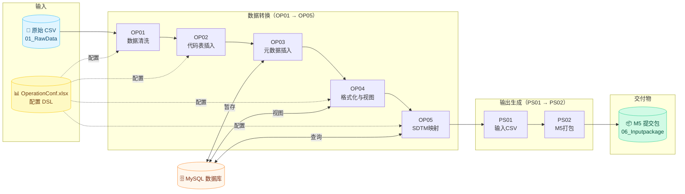

<div align="center">

[English](README.md) | [中文](README_CN.md)

<!-- Typing SVG -->
<a href="https://git.io/typing-svg">
  
</a>

<p><strong>通过 Excel 配置驱动的 7 步自动化流水线，<br/>将原始临床研究数据转换为 CDISC SDTM 数据集和 M5 监管提交包。</strong></p>

<!-- Badge wall -->
[](https://python.org)
[](https://pandas.pydata.org)
[](https://numpy.org)
[](https://dev.mysql.com/doc/connector-python/en/)
[](https://www.cdisc.org/standards/foundational/sdtm)
[](LICENSE)
[]()

<br/>

<!-- Hero banner -->


<br/>

[功能特性](#-功能特性) · [架构设计](#-架构设计) · [快速开始](#-快速开始) · [流水线步骤](#-流水线步骤) · [配置说明](#-配置说明) · [CLI 参考](#-cli-参考)

</div>

---

## 关于

**SDTM Mapping System**（代码名 **VAPORCONE**）是一套生产级 ETL 管道，专为临床试验数据标准化而构建。在 Excel 工作簿中定义映射规则，将流水线指向原始研究导出数据，即可获得符合 CDISC SDTM 标准的数据集以及可直接提交的 M5 监管包——无需编写任何 Python 代码。

---

## ✨ 功能特性

| | 功能 | 说明 |
|---|------|------|
| 📋 | **Excel 驱动配置** | 在 `OperationConf.xlsx` 中定义全部映射逻辑——工作簿即声明式 DSL |
| 🔗 | **7 步自动化流水线** | OP01~OP05（数据转换）+ PS01~PS02（输出生成），每步可独立运行 |
| 💻 | **交互式 CLI 控制台** | 内置 `sdtm` 命令，支持 run / status / list 及执行摘要 |
| ⚡ | **批量运行器** | `run_pipeline.py` 非交互执行，支持 `--continue` 和 `--dry-run` |
| 🗄️ | **MySQL 转换中枢** | 暂存表、自动创建索引和优化视图，实现高效数据处理 |
| 📦 | **M5 提交打包** | 直接生成监管提交包（JSON + M5 目录结构） |
| 🕐 | **时间戳版本管理** | 每次运行生成带时间戳的输出文件夹，完整可追溯、可审计 |
| 🌐 | **CJK 文字对齐** | 控制台输出正确处理中日文字符全角宽度 |
| 🚀 | **性能优化** | 向量化 pandas/numpy、多进程、预计算缓存、批量数据库插入 |

---

## 🏗️ 架构设计

<details open>
<summary><b>流水线流程图（Mermaid）</b></summary>
<br/>



</details>

<br/>

<details>
<summary><b>仓库结构预览</b></summary>
<br/>

<div align="center">

</div>

</details>

<br/>

### 模块组织

```
SDTM-Mapping-System/
│
├── 🔧 基类与工具 (VC_BC_*)
│   ├── VC_BC01_constant.py              # 项目配置、数据库凭据、路径
│   ├── VC_BC02_baseUtils.py             # 日志、控制台格式化、DatabaseManager
│   ├── VC_BC03_fetchConfig.py           # Excel 配置解析与验证
│   ├── VC_BC04_operateType.py           # 数据操作、表连接、CSV 缓存
│   └── VC_BC06_operateTypeFunctions.py  # 操作辅助函数
│
├── ⚙️ 转换流水线 (VC_OP_*)
│   ├── VC_OP01_cleaning.py              # 步骤 1 — 原始数据过滤与清洗
│   ├── VC_OP02_insertCodeList.py        # 步骤 2 — 代码表数据库插入
│   ├── VC_OP03_insertMetadata.py        # 步骤 3 — 元数据数据库插入
│   ├── VC_OP04_format.py                # 步骤 4 — 数据格式化与视图创建
│   └── VC_OP05_mapping.py               # 步骤 5 — SDTM 域映射
│
├── 📦 输出生成 (VC_PS_*)
│   ├── VC_PS01_makeInputCSV.py          # 步骤 6 — 输入 CSV 生成
│   └── VC_PS02_csv2json.py              # 步骤 7 — M5 包创建
│
├── 🚀 流水线运行器
│   ├── sdtm.py                          # 交互式 CLI 控制台
│   ├── sdtm.bat                         # Windows 启动器
│   └── run_pipeline.py                  # 批量流水线执行器
│
├── 📝 配置文件
│   ├── project.local.json               # 研究ID、数据库表名、路径
│   └── requirements.txt                 # Python 依赖
│
└── 📂 studySpecific/                    # 逐研究配置与数据
    ├── ENSEMBLE/
    │   ├── ENSEMBLE_OperationConf.xlsx   # 主配置工作簿（DSL）
    │   ├── VC_BC05_studyFunctions.py     # 研究特定自定义逻辑
    │   ├── 01_RawData/                   # 原始 CSV 输入文件
    │   ├── 02_Cleaning/                  # 步骤 1 输出（带时间戳）
    │   ├── 03_Format/                    # 步骤 4 输出（带时间戳）
    │   ├── 04_SDTM/                      # 步骤 5 输出（带时间戳）
    │   ├── 05_Inputfile/                 # 步骤 6 输出（带时间戳）
    │   └── 06_Inputpackage/              # 步骤 7 输出（M5 包）
    ├── CIRCULATE/
    └── COSMOS_GC/
```

<p align="right">(<a href="#关于">回到顶部</a>)</p>

---

## 🚀 快速开始

### 前置条件

- **Python 3.11+**
- **MySQL** 数据库服务器（本地或远程）
- **pip**

### 安装

```bash
# 克隆代码库
git clone https://github.com/hakupao/SDTM-Mapping-System.git
cd SDTM-Mapping-System

# 安装依赖
pip install -r requirements.txt
```

### 配置

在项目根目录创建或编辑 `project.local.json`：

```json
{
  "STUDY_ID": "ENSEMBLE",
  "CODELIST_TABLE_NAME": "VC05_ENSEMBLE_CODELIST",
  "METADATA_TABLE_NAME": "VC05_ENSEMBLE_METADATA",
  "TRANSDATA_VIEW_NAME": "VC05_ENSEMBLE_TRANSDATA",
  "M5_PROJECT_NAME": "ENSEMBLE",
  "ROOT_PATH": "C:\\Local\\iTMS\\SDTM_ENSEMBLE",
  "RAW_DATA_ROOT_PATH": "C:\\...\\studySpecific\\ENSEMBLE\\01_RawData"
}
```

### 运行

```bash
# 启动交互式控制台
python sdtm.py

# 或直接运行完整流水线
python run_pipeline.py
```

<p align="right">(<a href="#关于">回到顶部</a>)</p>

---

## 🔄 流水线步骤

| # | 模块 | 步骤ID | 名称 | 功能说明 |
|:-:|------|:------:|------|---------|
| 1 | `VC_OP01_cleaning` | OP01 | **数据清洗** | 按病例字典过滤原始 CSV，移除未映射的列和无效行 |
| 2 | `VC_OP02_insertCodeList` | OP02 | **代码表插入** | 将代码/术语映射插入 MySQL |
| 3 | `VC_OP03_insertMetadata` | OP03 | **元数据插入** | 解析清洗后数据，格式化值，将字段元数据插入 MySQL |
| 4 | `VC_OP04_format` | OP04 | **数据格式化** | 创建带索引的优化数据库视图，导出格式化 CSV |
| 5 | `VC_OP05_mapping` | OP05 | **SDTM映射** | 通过多进程应用 SDTM 域转换（DM、AE、LB、VS 等） |
| 6 | `VC_PS01_makeInputCSV` | PS01 | **输入CSV生成** | 将 SDTM 数据拆分为主域 CSV + SUPP* 伴随文件 |
| 7 | `VC_PS02_csv2json` | PS02 | **M5打包** | 生成 M5 提交包（JSON + 目录结构） |

<details>
<summary><b>数据流转图</b></summary>

```
01_RawData/  （原始 CSV 文件）
    │  [OP01] 按病例字典过滤，清洗列
    ▼
02_Cleaning/cleaning_dataset-{YYYYMMDDHHMMSS}/
    │  [OP02] 代码表  ──▶  MySQL CODELIST 表
    │  [OP03] 元数据  ──▶  MySQL METADATA 表
    ▼
MySQL: CODELIST + METADATA 表（含自动创建的索引）
    │  [OP04] 创建 TRANSDATA 视图，导出格式化 CSV
    ▼
03_Format/format_dataset-{YYYYMMDDHHMMSS}/
    │  [OP05] 应用 SDTM 域映射（并行处理）
    ▼
04_SDTM/sdtm_dataset-{YYYYMMDDHHMMSS}/
    │  [PS01] 拆分为主域 + SUPP* 文件
    ▼
05_Inputfile/inputfile_dataset-{YYYYMMDDHHMMSS}/
    │  [PS02] 构建 M5 JSON 包结构
    ▼
06_Inputpackage/inputpackage_dataset-{YYYYMMDDHHMMSS}/
    └── m5/m5/datasets/{STUDY}/tabulations/sdtm/
```

</details>

<p align="right">(<a href="#关于">回到顶部</a>)</p>

---

## 💻 CLI 参考

<div align="center">

</div>

<br/>

### 交互式控制台（`sdtm.py`）

```bash
python sdtm.py          # 进入交互模式
sdtm                    # Windows 快捷方式（通过 sdtm.bat）
python sdtm.py run all  # 一次性运行后退出
```

| 命令 | 说明 |
|------|------|
| `run all` | 运行全部 7 步（OP01 ~ PS02） |
| `run <n>` | 从第 n 步开始运行到最后 |
| `run <n> <m>` | 运行第 n 到 m 步 |
| `run op03 ps01` | 按步骤ID运行（不区分大小写） |
| `run ... --continue` | 失败后继续执行后续步骤 |
| `status` | 显示各阶段最新输出时间和历史版本数 |
| `list` | 列出所有流水线步骤 |
| `help` | 显示可用命令 |
| `exit` | 退出控制台 |

### 批量运行器（`run_pipeline.py`）

```bash
python run_pipeline.py              # 运行全部 7 步
python run_pipeline.py 3            # 从第 3 步开始
python run_pipeline.py 3 5          # 只运行第 3 ~ 5 步
python run_pipeline.py --continue   # 失败后继续
python run_pipeline.py --dry-run    # 仅预览执行计划，不实际运行
```

### 单独运行

每个步骤模块都可以独立运行：

```bash
python VC_OP01_cleaning.py
python VC_OP05_mapping.py
python VC_PS02_csv2json.py
```

<p align="right">(<a href="#关于">回到顶部</a>)</p>

---

## 📋 配置说明

### Excel 配置 DSL — `OperationConf.xlsx`

主配置工作簿驱动整个流水线，每张工作表控制一个特定方面：

| 工作表 | 用途 |
|-------|------|
| **SheetSetting** | 各工作表的列配置与起始行定义 |
| **CaseList** | 患者ID映射（SUBJID &#8594; USUBJID）及迁移标志 |
| **FileDict** | 原始数据文件定义（文件名、编码、分隔符） |
| **FieldDict** | 字段规格、数据类型与转换规则 |
| **CodeList** | 代码/术语值映射 |
| **Mapping** | SDTM 域转换规则（DM、AE、LB、VS、EV 等） |
| **Combine** | 自定义表连接/合并定义 |

### 研究特定函数 — `VC_BC05_studyFunctions.py`

对于无法在 Excel DSL 中表达的域逻辑，每个研究可定义自定义 Python 函数：

```python
def DM():
    """自定义 DM 域生成。

    数据源：RGST（登录）、LSVDAT（最终生存）、OC（转归）
    计算项：RFENDAT（结束日期）、DTHFLG（死亡标志）
    """
    ...
```

### 项目配置 — `project.local.json`

| 键 | 说明 |
|----|------|
| `STUDY_ID` | 当前活动的研究标识 |
| `CODELIST_TABLE_NAME` | MySQL 代码表表名 |
| `METADATA_TABLE_NAME` | MySQL 元数据表名 |
| `TRANSDATA_VIEW_NAME` | MySQL 格式化数据视图名 |
| `M5_PROJECT_NAME` | M5 包输出中的项目名称 |
| `ROOT_PATH` | 项目根目录绝对路径 |
| `RAW_DATA_ROOT_PATH` | 原始数据目录绝对路径 |

<p align="right">(<a href="#关于">回到顶部</a>)</p>

---

## 🛠️ 技术栈


| 包名 | 版本 | 用途 |
|-----|:----:|------|
| **mysql-connector-python** | 9.4.0 | MySQL 数据库连接 |
| **pandas** | 2.3.1 | 数据操作与转换 |
| **numpy** | 2.2.6 | 数值运算 |
| **openpyxl** | 3.1.5 | Excel 工作簿读取 |
| **python-dateutil** | 2.9.0 | 日期解析与格式化 |

```bash
pip install -r requirements.txt
```

<p align="right">(<a href="#关于">回到顶部</a>)</p>

---

## 📄 许可证

基于 MIT 许可证分发。详见 [LICENSE](LICENSE)。

---

## 📬 联系与支持

- **问题反馈** — [GitHub Issues](https://github.com/hakupao/SDTM-Mapping-System/issues)
- **交流讨论** — [GitHub Discussions](https://github.com/hakupao/SDTM-Mapping-System/discussions)

---

<div align="center">

**[⬆ 回到顶部](#关于)**

为临床数据专业人士用心打造

<a href="https://github.com/hakupao/SDTM-Mapping-System/graphs/contributors">
  
</a>

</div>
