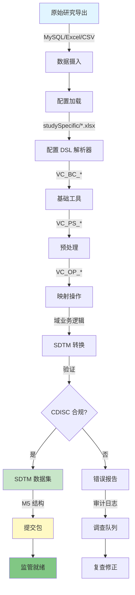

[English](README.md) | [中文](README_CN.md)

<div align="center">


**将原始临床研究数据转换为标准化的 CDISC SDTM 数据集和 M5 提交包，使用声明式 Excel 配置。**

[功能特性](#功能特性) • [架构设计](#架构设计) • [快速开始](#快速开始) • [配置说明](#配置说明) • [贡献指南](#贡献指南)

</div>

---

## 项目概述

SDTM Mapping System（代码名：**VAPORCONE**）是一套生产级、配置驱动的临床试验数据标准化 ETL 管道。它将原始研究导出数据转换为符合 CDISC SDTM 标准的数据集和监管 M5 提交包。

**为什么选择 SDTM Mapping System？**
- 📋 **配置即代码**：Excel 工作簿作为"配置 DSL"——无需编写 Python 代码即可定义研究特定的映射
- 🔄 **模块化管道**：清晰分离的基础工具（VC_BC*）、操作模块（VC_OP*）和预处理模块（VC_PS*）
- 📊 **生产级质量**：专为企业临床试验工作流和 CDISC 合规性构建
- 🗄️ **多源集成**：与 MySQL、Excel 和其他研究导出格式无缝集成
- 🎯 **研究隔离**：`studySpecific/` 目录中的逐研究配置确保可重复性和可审计性

---

## 关键功能

| 功能 | 说明 |
|------|------|
| 🎛️ **Excel 驱动配置** | 在易读的 Excel 工作簿中定义整个映射逻辑 |
| 🔗 **CDISC SDTM 合规** | 自动验证 SDTM IG 标准 |
| 📦 **M5 包生成** | 直接生成监管提交包 |
| 🔀 **复杂 ETL 工作流** | 预处理、转换、验证在一个管道中完成 |
| 💾 **多数据库支持** | MySQL、Excel、CSV、Parquet 集成 |
| 📈 **审计追踪** | 从源数据到 SDTM 数据集的完整可追踪性 |
| ⚡ **向量化操作** | 利用 pandas/numpy 在规模化应用中实现高性能 |
| 🎨 **可视化管道检查** | 数据流预览 SVG 图表（docs/assets/） |

---

## 架构设计



### 模块组织

```
SDTM-Mapping-System/
├── VC_BC_*.py              # 基类和工具函数
├── VC_OP_*.py              # 映射操作
├── VC_PS_*.py              # 预处理模块
├── main.py                 # 管道编排器
├── config.toml             # 全局配置
├── studySpecific/          # 逐研究配置
│   ├── STUDY001/
│   │   ├── mapping.xlsx    # 研究映射 DSL
│   │   └── rules.json      # 自定义业务逻辑
│   └── STUDY002/
│       └── mapping.xlsx
├── docs/
│   ├── assets/
│   │   ├── hero.svg        # 架构图
│   │   └── preview.svg     # 数据流可视化
│   └── MAPPING_GUIDE.md    # 配置参考
└── tests/                  # 单元测试和集成测试
```

---

## 快速开始

### 前置条件

- **Python 3.11+**
- **pip** 或 **conda**
- MySQL 数据库（可选，也支持 CSV/Excel）

### 安装

```bash
# 克隆代码库
git clone https://github.com/hakupao/SDTM-Mapping-System.git
cd SDTM-Mapping-System

# 安装依赖
pip install -r requirements.txt

# 验证安装
python -c "import VC_BC; print('✓ 安装成功')"
```

### 你的第一个 SDTM 映射（5 分钟）

```bash
# 1. 准备原始数据
cp /path/to/study_export.xlsx data/raw/

# 2. 创建研究配置
cp studySpecific/TEMPLATE/mapping.xlsx studySpecific/MY_STUDY/mapping.xlsx
# 编辑 Excel 文件，定义你的域映射

# 3. 运行管道
python main.py --study MY_STUDY --output ./output/

# 4. 查看 SDTM 数据集
ls output/MY_STUDY/sdtm/
# dm.xlsx, ae.xlsx, ev.xlsx, ...
```

---

## 配置说明

### Excel 配置 DSL

魔力在 `studySpecific/YOUR_STUDY/mapping.xlsx` 中实现：

| 工作表 | 用途 | 示例 |
|-------|------|------|
| **DataSources** | 原始数据位置 | `SOURCE_PATH: C:/data/export.csv` |
| **Demographics** | DM 域映射 | `SOURCE.PatientID → SDTM.USUBJID` |
| **Adverse Events** | AE 域映射 | `SOURCE.AdverseEvent → SDTM.AEDECOD` |
| **Lab** | LB 域映射 | 测量值、结果、日期 |
| **Vital Signs** | VS 域映射 | 血压、心率、体温 |
| **Validation Rules** | 业务逻辑 | 自定义检查、预期范围 |
| **Terminology** | SDTM 代码表映射 | ICD10 → MedDRA 转换 |

#### 示例：人口统计学映射

```
源列名           | SDTM 列名   | 转换规则        | 必需
PatientID        | USUBJID     | 前缀添加地点    | ✓
Sex              | SEX         | M→M, F→F        | ✓
DOB              | BRTHDTC     | ISO 8601 日期   | ✓
Status           | ACTARMCD    | Active→ACTIVE   | ✓
```

### 主配置文件 (config.toml)

```toml
[pipeline]
log_level = "INFO"
validate_cdisc = true
output_format = "xlsx"  # xlsx, sas, parquet

[database]
type = "mysql"
host = "localhost"
port = 3306
database = "clinical_data"

[m5_package]
enabled = true
submission_type = "IND"  # IND, BLA, NDA
sponsor_id = "1234567"
```

---

## 使用示例

### 基础管道执行

```python
from VC_BC_core import Pipeline
from VC_PS_preprocessing import PreProcessor
from VC_OP_sdtm import SDTMTransformer

# 加载配置
config = Pipeline.load_config("studySpecific/MY_STUDY/mapping.xlsx")

# 初始化管道阶段
prep = PreProcessor(config)
transformer = SDTMTransformer(config)

# 执行
raw_data = prep.load_raw_data()
clean_data = prep.execute()
sdtm_data = transformer.map_to_sdtm(clean_data)

# 验证和导出
sdtm_data.validate()
sdtm_data.export_m5_package("./output/")
```

### 自定义预处理

```python
from VC_PS_preprocessing import PreProcessor

class CustomPreProcessor(PreProcessor):
    def handle_missing_values(self, df):
        # 研究特定的逻辑
        return df.fillna(method='bfill')

processor = CustomPreProcessor(config)
data = processor.execute()
```

### 验证和质量保证

```python
from VC_OP_validation import Validator

validator = Validator(config)
report = validator.validate_sdtm_compliance(sdtm_data)

print(f"✓ 通过: {report.passed_checks}")
print(f"✗ 失败: {report.failed_checks}")
print(f"⚠ 警告: {report.warnings}")

# 导出审计追踪
report.export_html("audit_report.html")
```

---

## 依赖包

| 包名 | 版本 | 用途 |
|-----|------|------|
| **pandas** | 2.3.1 | 数据操作和转换 |
| **numpy** | 2.2.6 | 数值运算 |
| **openpyxl** | 3.1.5 | Excel 配置读取 |
| **mysql-connector-python** | 9.4.0 | 数据库连接 |
| **pydantic** | 2.0+ | 配置验证 |
| **lxml** | 4.9+ | XML/SAS7BDAT 处理 |
| **requests** | 2.28+ | API 集成 |

安装所有依赖：
```bash
pip install pandas==2.3.1 numpy==2.2.6 openpyxl==3.1.5 mysql-connector-python==9.4.0
```

---

## 项目结构

<details>
<summary><b>📁 详细文件组织</b></summary>

```
SDTM-Mapping-System/
│
├── 📄 README.md & README_CN.md
├── 📄 requirements.txt
├── 📄 config.toml
├── 📄 main.py                    # 入口点
│
├── 🔧 基础工具 (VC_BC_*)
│   ├── VC_BC_core.py             # 管道编排
│   ├── VC_BC_config.py           # 配置加载器
│   ├── VC_BC_data.py             # 数据结构
│   └── VC_BC_logger.py           # 日志和审计追踪
│
├── 🔄 预处理 (VC_PS_*)
│   ├── VC_PS_preprocessing.py    # 主预处理
│   ├── VC_PS_cleaning.py         # 数据清洗
│   ├── VC_PS_validation.py       # 输入验证
│   └── VC_PS_encoding.py         # 字符编码处理
│
├── 🗺️  映射操作 (VC_OP_*)
│   ├── VC_OP_sdtm.py             # SDTM 转换
│   ├── VC_OP_domains.py          # 域特定逻辑
│   ├── VC_OP_terminology.py      # 代码表映射
│   └── VC_OP_validation.py       # CDISC 验证
│
├── 📊 研究配置
│   ├── studySpecific/
│   │   ├── TEMPLATE/
│   │   │   ├── mapping.xlsx
│   │   │   └── rules.json
│   │   ├── STUDY001/
│   │   │   └── mapping.xlsx
│   │   └── STUDY002/
│   │       └── mapping.xlsx
│
├── 📚 文档
│   ├── docs/
│   │   ├── MAPPING_GUIDE.md
│   │   ├── API_REFERENCE.md
│   │   ├── TROUBLESHOOTING.md
│   │   └── assets/
│   │       ├── hero.svg
│   │       └── preview.svg
│
└── ✅ 测试
    ├── tests/
    │   ├── test_bc_core.py
    │   ├── test_ps_preprocessing.py
    │   ├── test_op_sdtm.py
    │   └── test_integration.py
```

</details>

---

## 高级话题

<details>
<summary><b>🚀 性能调优</b></summary>

### 向量化操作

```python
# ✓ 好：向量化
df['SDTM_VALUE'] = df['RAW_VALUE'].apply(transformation_func)

# ✗ 避免：逐行迭代
for idx, row in df.iterrows():
    df.at[idx, 'SDTM_VALUE'] = transform(row['RAW_VALUE'])
```

### 内存优化

```python
# 高效使用数据类型
df['USUBJID'] = df['USUBJID'].astype('category')
df['SEX'] = df['SEX'].astype('category')

# 分块处理大型数据集
for chunk in pd.read_csv('huge_file.csv', chunksize=10000):
    process_chunk(chunk)
```

### 并行处理

```python
from multiprocessing import Pool

def process_study(study_id):
    config = load_config(f"studySpecific/{study_id}/mapping.xlsx")
    return execute_pipeline(config)

with Pool(4) as p:
    results = p.map(process_study, ['STUDY001', 'STUDY002', ...])
```

</details>

<details>
<summary><b>🔐 数据安全和合规</b></summary>

- **审计追踪**：所有转换都记录时间戳
- **去识别化**：内置的 PHI 掩码（日期、姓名）
- **加密**：可选的字段级敏感数据加密
- **访问控制**：通过配置的研究级访问策略
- **HIPAA 合规**：遵循 HIPAA 隐私规则进行数据处理
- **验证检查点**：导出前的强制验证门控

</details>

<details>
<summary><b>🐛 故障排除</b></summary>

| 错误 | 原因 | 解决方案 |
|-----|------|--------|
| `ConfigNotFoundError` | 缺少 mapping.xlsx | 验证 config.toml 中的路径 |
| `DataValidationFailed` | 源数据无效 | 查看 validation_report.html |
| `SDTMComplianceFailed` | CDISC 规则违反 | 检查 CDISC_errors.log |
| `DatabaseConnectionError` | MySQL 连接问题 | 验证 config.toml 中的凭证 |

查看详细日志：
```bash
tail -f logs/pipeline_$(date +%Y%m%d).log
```

</details>

---

## 贡献指南

欢迎贡献！请先阅读 [CONTRIBUTING.md](CONTRIBUTING.md)。

```bash
# Fork 并克隆
git clone https://github.com/YOUR_USERNAME/SDTM-Mapping-System.git
cd SDTM-Mapping-System

# 创建功能分支
git checkout -b feature/my-improvement

# 进行更改，添加测试
pytest tests/

# 提交和推送
git commit -m "feat: add new domain mapping support"
git push origin feature/my-improvement

# 创建 Pull Request
```

---

## 路线图

- [ ] 映射配置 UI 仪表盘
- [ ] 实时验证反馈
- [ ] AI 驱动的术语映射建议
- [ ] 多研究批量处理
- [ ] 云部署模板（Docker、K8s）
- [ ] OpenAPI 管道 API 规范

---

## 许可证

MIT License © 2024 hakupao

---

## 引用

如果在你的研究中使用了 SDTM Mapping System，请引用：

```bibtex
@software{vaporcone2024,
  author = {hakupao},
  title = {SDTM Mapping System: Clinical Trial ETL for CDISC Standardization},
  url = {https://github.com/hakupao/SDTM-Mapping-System},
  year = {2024}
}
```

---

## 联系和支持

- 📧 **问题**：[GitHub Issues](https://github.com/hakupao/SDTM-Mapping-System/issues)
- 💬 **讨论**：[GitHub Discussions](https://github.com/hakupao/SDTM-Mapping-System/discussions)
- 📖 **文档**：[docs/](docs/)

---

<div align="center">

**[⬆ 返回顶部](#-sdtm-mapping-system)**

为临床数据专业人士用心打造

</div>
