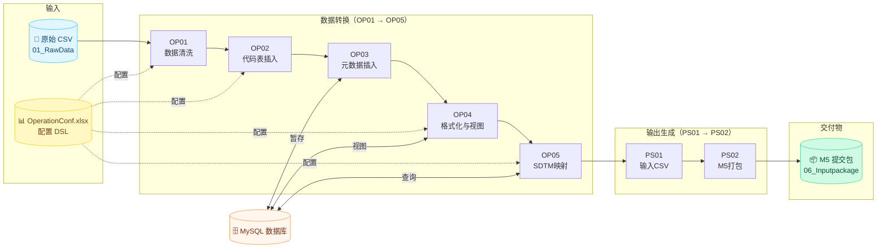

<div align="center">

[English](README.md) | [中文](README_CN.md)

<!-- Typing SVG -->
<a href="https://git.io/typing-svg">
  
</a>

<p><strong>通过 Excel 配置驱动的 7 步自动化流水线，<br/>将原始临床研究数据转换为 CDISC SDTM 数据集和 M5 监管提交包。</strong></p>

<!-- Badge wall -->
[](https://python.org)
[](https://pandas.pydata.org)
[](https://numpy.org)
[](https://dev.mysql.com/doc/connector-python/en/)
[](https://www.cdisc.org/standards/foundational/sdtm)
[](LICENSE)
[]()

<br/>

<!-- Hero banner -->


<br/>

[功能特性](#-功能特性) · [架构设计](#-架构设计) · [快速开始](#-快速开始) · [流水线步骤](#-流水线步骤) · [配置说明](#-配置说明) · [CLI 参考](#-cli-参考)

</div>

---

## 关于

**SDTM Mapping System**（代码名 **VAPORCONE**）是一套生产级 ETL 管道，专为临床试验数据标准化而构建。在 Excel 工作簿中定义映射规则，将流水线指向原始研究导出数据，即可获得符合 CDISC SDTM 标准的数据集以及可直接提交的 M5 监管包——无需编写任何 Python 代码。

---

## ✨ 功能特性

| | 功能 | 说明 |
|---|------|------|
| 📋 | **Excel 驱动配置** | 在 `OperationConf.xlsx` 中定义全部映射逻辑——工作簿即声明式 DSL |
| 🔗 | **7 步自动化流水线** | OP01~OP05（数据转换）+ PS01~PS02（输出生成），每步可独立运行 |
| 💻 | **交互式 CLI 控制台** | 内置 `sdtm` 命令，支持 run / status / list 及执行摘要 |
| ⚡ | **批量运行器** | `run_pipeline.py` 非交互执行，支持 `--continue` 和 `--dry-run` |
| 🗄️ | **MySQL 转换中枢** | 暂存表、自动创建索引和优化视图，实现高效数据处理 |
| 📦 | **M5 提交打包** | 直接生成监管提交包（JSON + M5 目录结构） |
| 🕐 | **时间戳版本管理** | 每次运行生成带时间戳的输出文件夹，完整可追溯、可审计 |
| 🌐 | **CJK 文字对齐** | 控制台输出正确处理中日文字符全角宽度 |
| 🚀 | **性能优化** | 向量化 pandas/numpy、多进程、预计算缓存、批量数据库插入 |

---

## 🏗️ 架构设计

<details open>
<summary><b>流水线流程图（Mermaid）</b></summary>
<br/>


```mermaid
graph LR
    subgraph INPUT["输入"]
        A[("📄 原始 CSV<br/>01_RawData")]
        J[("📊 OperationConf.xlsx<br/>配置 DSL")]
    end

    subgraph TRANSFORM["数据转换（OP01 → OP05）"]
        B["OP01<br/>数据清洗"]
        C["OP02<br/>代码表插入"]
        D["OP03<br/>元数据插入"]
        E["OP04<br/>格式化与视图"]
        F["OP05<br/>SDTM映射"]
    end

    subgraph OUTPUT["输出生成（PS01 → PS02）"]
        G["PS01<br/>输入CSV"]
        H["PS02<br/>M5打包"]
    end

    subgraph DELIVER["交付物"]
        I[("📦 M5 提交包<br/>06_Inputpackage")]
    end

    K[("🗄️ MySQL 数据库")]

    A --> B --> C --> D --> E --> F --> G --> H --> I
    J -.->|配置| B
    J -.->|配置| C
    J -.->|配置| E
    J -.->|配置| F
    K <-->|暂存| D
    K <-->|视图| E
    K <-->|查询| F

    style A fill:#e1f5ff,stroke:#38BDF8,color:#0c4a6e
    style I fill:#d1fae5,stroke:#34D399,color:#064e3b
    style J fill:#fef9c3,stroke:#FACC15,color:#713f12
    style K fill:#fff7ed,stroke:#FB923C,color:#7c2d12
```

</details>

<br/>

<details>
<summary><b>仓库结构预览</b></summary>
<br/>

<div align="center">

</div>

</details>

<br/>

### 模块组织

```
SDTM-Mapping-System/
│
├── 🔧 基类与工具 (VC_BC_*)
│   ├── VC_BC01_constant.py              # 项目配置、数据库凭据、路径
│   ├── VC_BC02_baseUtils.py             # 日志、控制台格式化、DatabaseManager
│   ├── VC_BC03_fetchConfig.py           # Excel 配置解析与验证
│   ├── VC_BC04_operateType.py           # 数据操作、表连接、CSV 缓存
│   └── VC_BC06_operateTypeFunctions.py  # 操作辅助函数
│
├── ⚙️ 转换流水线 (VC_OP_*)
│   ├── VC_OP01_cleaning.py              # 步骤 1 — 原始数据过滤与清洗
│   ├── VC_OP02_insertCodeList.py        # 步骤 2 — 代码表数据库插入
│   ├── VC_OP03_insertMetadata.py        # 步骤 3 — 元数据数据库插入
│   ├── VC_OP04_format.py                # 步骤 4 — 数据格式化与视图创建
│   └── VC_OP05_mapping.py               # 步骤 5 — SDTM 域映射
│
├── 📦 输出生成 (VC_PS_*)
│   ├── VC_PS01_makeInputCSV.py          # 步骤 6 — 输入 CSV 生成
│   └── VC_PS02_csv2json.py              # 步骤 7 — M5 包创建
│
├── 🚀 流水线运行器
│   ├── sdtm.py                          # 交互式 CLI 控制台
│   ├── sdtm.bat                         # Windows 启动器
│   └── run_pipeline.py                  # 批量流水线执行器
│
├── 📝 配置文件
│   ├── project.local.json               # 机器设置：研究根目录、默认研究、数据库（不提交）
│   ├── examples/                        # project.local.json 示例 + 可运行的 DEMO 研究
│   └── requirements.txt                 # Python 依赖
│
└── 📂 studySpecific/                    # 逐研究配置与数据（不在本仓库中，见下）
    └── <STUDY_ID>/
        ├── <STUDY_ID>_OperationConf.xlsx # 主配置工作簿（DSL）
        ├── VC_BC05_studyFunctions.py     # 研究特定自定义逻辑
        ├── 01_RawData/                   # 原始 CSV 输入文件
        ├── 02_Cleaning/                  # 步骤 1 输出（带时间戳）
        ├── 03_Format/                    # 步骤 4 输出（带时间戳）
        ├── 04_SDTM/                      # 步骤 5 输出（带时间戳）
        ├── 05_Inputfile/                 # 步骤 6 输出（带时间戳）
        └── 06_Inputpackage/              # 步骤 7 输出（M5 包）
```

> **研究目录不在本仓库中。** `studySpecific/` 在本仓库被 git 忽略，临床文档和数据不会进入公开历史。
> 请将研究放在独立的（私有）仓库中，或克隆到 `studySpecific/` 下，
> 或在 `project.local.json` 里用 `STUDIES_ROOT_PATH` 指向其位置。

<p align="right">(<a href="#关于">回到顶部</a>)</p>

---

## 🚀 快速开始

### 前置条件

- **Python 3.11+**
- **MySQL** 数据库服务器（本地或远程）。配置的账号需要 `CREATE DATABASE` / `CREATE TABLE` / `CREATE VIEW` 权限：流水线会自行创建数据库和表
- **pip**

### 安装

```bash
# 克隆代码库
git clone https://github.com/hakupao/SDTM-Mapping-System.git
cd SDTM-Mapping-System

# 安装依赖
pip install -r requirements.txt
```

### 配置

在项目根目录创建 `project.local.json`（参考 `examples/project.local.json.example`）。
它只描述**这台机器**；研究相关的设置放在各研究目录内。

```json
{
  "STUDIES_ROOT_PATH": "C:\\path\\to\\SDTM-Studies",
  "DEFAULT_STUDY": "ENSEMBLE"
}
```

每个研究是一个目录 `<STUDIES_ROOT_PATH>/<STUDY_ID>/`，内含
`<STUDY_ID>_OperationConf.xlsx`、`VC_BC05_studyFunctions.py` 和可选的
`study.json`。完整可运行的示例见 `examples/studies/DEMO/`。

### 先跑一下自带的示例

```bash
# 按上文把 STUDIES_ROOT_PATH 指向 examples/studies，然后
python run_pipeline.py --study DEMO
```

3 名虚构受试者约 10 秒走完全部 7 步，在 `examples/studies/DEMO/` 下生成 DM、DS、SS 和 M5 包。
详见 `examples/studies/DEMO/README.md`。

### 运行

```bash
# 启动指定研究的交互式控制台
python sdtm.py ENSEMBLE

# 或直接运行完整流水线
python run_pipeline.py --study ENSEMBLE
```

研究也可以通过环境变量 `SDTM_STUDY` 或 `project.local.json` 的 `DEFAULT_STUDY` 指定；
研究根目录下只有一个研究时会自动选中。

<p align="right">(<a href="#关于">回到顶部</a>)</p>

---

## 🔄 流水线步骤

| # | 模块 | 步骤ID | 名称 | 功能说明 |
|:-:|------|:------:|------|---------|
| 1 | `VC_OP01_cleaning` | OP01 | **数据清洗** | 按病例字典过滤原始 CSV，移除未映射的列和无效行 |
| 2 | `VC_OP02_insertCodeList` | OP02 | **代码表插入** | 将代码/术语映射插入 MySQL |
| 3 | `VC_OP03_insertMetadata` | OP03 | **元数据插入** | 解析清洗后数据，格式化值，将字段元数据插入 MySQL |
| 4 | `VC_OP04_format` | OP04 | **数据格式化** | 创建带索引的优化数据库视图，导出格式化 CSV |
| 5 | `VC_OP05_mapping` | OP05 | **SDTM映射** | 通过多进程应用 SDTM 域转换（DM、AE、LB、VS 等） |
| 6 | `VC_PS01_makeInputCSV` | PS01 | **输入CSV生成** | 将 SDTM 数据拆分为主域 CSV + SUPP* 伴随文件 |
| 7 | `VC_PS02_csv2json` | PS02 | **M5打包** | 生成 M5 提交包（JSON + 目录结构） |

<details>
<summary><b>数据流转图</b></summary>

```
01_RawData/  （原始 CSV 文件）
    │  [OP01] 按病例字典过滤，清洗列
    ▼
02_Cleaning/cleaning_dataset-{YYYYMMDDHHMMSS}/
    │  [OP02] 代码表  ──▶  MySQL CODELIST 表
    │  [OP03] 元数据  ──▶  MySQL METADATA 表
    ▼
MySQL: CODELIST + METADATA 表（含自动创建的索引）
    │  [OP04] 创建 TRANSDATA 视图，导出格式化 CSV
    ▼
03_Format/format_dataset-{YYYYMMDDHHMMSS}/
    │  [OP05] 应用 SDTM 域映射（并行处理）
    ▼
04_SDTM/sdtm_dataset-{YYYYMMDDHHMMSS}/
    │  [PS01] 拆分为主域 + SUPP* 文件
    ▼
05_Inputfile/inputfile_dataset-{YYYYMMDDHHMMSS}/
    │  [PS02] 构建 M5 JSON 包结构
    ▼
06_Inputpackage/inputpackage_dataset-{YYYYMMDDHHMMSS}/
    └── m5/m5/datasets/{STUDY}/tabulations/sdtm/
```

</details>

<p align="right">(<a href="#关于">回到顶部</a>)</p>

---

## 💻 CLI 参考

<div align="center">

</div>

<br/>

### 交互式控制台（`sdtm.py`）

```bash
python sdtm.py <STUDY>            # 进入指定研究的交互模式
sdtm <STUDY>                      # Windows 快捷方式（通过 sdtm.bat）
sdtm <STUDY> run all              # 一次性运行后退出
sdtm studies                      # 列出 STUDIES_ROOT_PATH 下的所有研究
sdtm --study <STUDY> status       # 与 sdtm <STUDY> status 等价
```

设置了 `SDTM_STUDY` / `DEFAULT_STUDY`，或只有一个研究时，`<STUDY>` 可以省略。

| 命令 | 说明 |
|------|------|
| `run all` | 运行全部 7 步（OP01 ~ PS02） |
| `run <n>` | 仅运行第 n 步 |
| `run <n> <m>` | 运行第 n 到 m 步 |
| `run op03` | 仅运行 OP03（步骤 ID 不区分大小写） |
| `run op03 ps01` | 按步骤 ID 运行区间 |
| `run ... --continue` | 失败后继续执行 |
| `status` | 查看各阶段最新输出时间与版本数 |
| `studies` | 列出可用研究 |
| `list` | 列出所有流水线步骤 |
| `help` | 显示可用命令 |
| `exit` | 退出控制台 |

### 批量运行器（`run_pipeline.py`）

```bash
python run_pipeline.py --study ENSEMBLE       # 运行 ENSEMBLE 的全部 7 步
python run_pipeline.py 3                      # 从第 3 步开始（研究取自环境变量 / DEFAULT_STUDY）
python run_pipeline.py 3 5                    # 仅运行第 3 ~ 5 步
python run_pipeline.py --continue             # 失败后继续
python run_pipeline.py --dry-run              # 仅预览执行计划，不实际运行
```

### 单独运行

每个步骤模块都可以独立运行：

```bash
python VC_OP01_cleaning.py
python VC_OP05_mapping.py
python VC_PS02_csv2json.py
```

<p align="right">(<a href="#关于">回到顶部</a>)</p>

---

## 📋 配置说明

### Excel 配置 DSL — `OperationConf.xlsx`

主配置工作簿驱动整个流水线，每张工作表控制一个特定方面：

| 工作表 | 列（第 1 行为表头） | 用途 |
|-------|------------------|------|
| **SheetSetting** | `SheetName`、`StartingRow`，之后是其他各表的列名 | 工作簿索引：记录每个表的数据起始行和列顺序，解析器通过它读取其余所有表 |
| **Patients** | `USUBJID`、`SUBJID`、`MIGRATIONFLAG` | 要迁移的受试者及 `SUBJID` → `USUBJID` 对应关系 |
| **Files** | `FILENAME`、`MIGRATIONFLAG`、`TITLEROW`、`DATARROW`、`SUBJIDFIELDID`、`PROCESSINGLOGIC` | `01_RawData/` 下的原始 CSV：表头行、数据起始行、受试者 ID 列 |
| **Process** | `FILENAME`、`FIELDNAME`、`LABEL`、`DATATYPE`、`CODELISTNAME`、`MIGRATIONFLAG`、`CHKTYPE`、`OTHERDETAILSPROCESS` | 每个原始文件的每个字段：标签、数据类型、代码表、是否保留、附加格式规则 |
| **CodeList** | `CODELISTNAME`、`CODE`、`VALUERAW`、`VALUEEN`、`VALUESDTM` | 代码/术语映射（原始值 → 英文 → SDTM 受控术语） |
| **Mapping** | `DEFINITION`、`DOMAIN`、`VARIABLE`、`NDKEY`、`FILENAME`、`FIELDNAME`、`OPERTYPE`、`PARAMETER` | SDTM 域规则：每个目标变量一行，指定来源文件/字段和所用操作 |
| **Combine** | `FILENAME`、`FUNCTION` | 由 `VC_BC05_studyFunctions.py` 中的 Python 函数（如 `DM()`）生成的派生表，可在 Mapping 中作为 `FILENAME` 引用 |
| **DomainsSetting** | `DOMAIN`、`SEQFIELD`、`SORTKEYS` | 各域的排序键和用于编号的 `--SEQ` 变量 |
| **Sites** | `SITENAME`、`SITECODE` | 生成 M5 输入 CSV 时使用的施设名 → 施设代码对照 |

九个表都必须存在。`examples/studies/DEMO/DEMO_OperationConf.xlsx` 是一份最小可用工作簿，其 README 逐表说明。

### 研究特定函数 — `VC_BC05_studyFunctions.py`

对于无法在 Excel DSL 中表达的域逻辑，每个研究可定义自定义 Python 函数：

```python
def DM():
    """自定义 DM 域生成。

    数据源：RGST（登录）、LSVDAT（最终生存）、OC（转归）
    计算项：RFENDAT（结束日期）、DTHFLG（死亡标志）
    """
    ...
```

### 项目配置 — `project.local.json`

机器级设置（不提交到仓库）。所有键均可选。

| 键 | 说明 |
|----|------|
| `STUDIES_ROOT_PATH` | 研究目录的父目录。默认 `<项目根目录>/studySpecific` |
| `DEFAULT_STUDY` | 命令行 / `SDTM_STUDY` 未指定时使用的研究 |
| `DB_HOST` / `DB_USER` / `DB_PASSWORD` / `DB_DATABASE` | MySQL 连接（默认 `127.0.0.1` / `root` / `root` / `VC-DataMigration_2.0`） |

**研究解析顺序：** 命令行参数 → 环境变量 `SDTM_STUDY` → `DEFAULT_STUDY` →
旧格式 `STUDY_ID` → 研究根目录下唯一的研究 → 报错并列出可用研究。

### 研究配置 — `<STUDY_ID>/study.json`

可选，放在研究目录内。缺省时全部按研究 ID 推导。

| 键 | 默认值 | 说明 |
|----|--------|------|
| `M5_PROJECT_NAME` | `<STUDY_ID>` | M5 包输出中的项目名称 |
| `RAW_DATA_DIR` | `01_RawData` | 原始 CSV 目录，相对研究目录 |
| `RAW_DATA_ROOT_PATH` | – | 原始 CSV 目录绝对路径（覆盖 `RAW_DATA_DIR`） |
| `CODELIST_TABLE_NAME` | `VC05_<STUDY_ID>_CODELIST` | MySQL 代码表表名 |
| `METADATA_TABLE_NAME` | `VC05_<STUDY_ID>_METADATA` | MySQL 元数据表名 |
| `TRANSDATA_VIEW_NAME` | `VC05_<STUDY_ID>_TRANSDATA` | MySQL 格式化数据视图名 |

> **旧格式兼容：** 含 `STUDY_ID`、表名和 `RAW_DATA_ROOT_PATH` 的 `project.local.json`
> （2026-09 之前的布局）无需修改即可继续使用。

<p align="right">(<a href="#关于">回到顶部</a>)</p>

---

## 🛠️ 技术栈


| 包名 | 版本 | 用途 |
|-----|:----:|------|
| **mysql-connector-python** | 9.4.0 | MySQL 数据库连接 |
| **pandas** | 2.3.1 | 数据操作与转换 |
| **numpy** | 2.2.6 | 数值运算 |
| **openpyxl** | 3.1.5 | Excel 工作簿读取 |
| **python-dateutil** | 2.9.0 | 日期解析与格式化 |

```bash
pip install -r requirements.txt
```

<p align="right">(<a href="#关于">回到顶部</a>)</p>

---

## 📄 许可证

基于 MIT 许可证分发。详见 [LICENSE](LICENSE)。

---

## 📬 联系与支持

- **问题反馈** — [GitHub Issues](https://github.com/hakupao/SDTM-Mapping-System/issues)
- **交流讨论** — [GitHub Discussions](https://github.com/hakupao/SDTM-Mapping-System/discussions)

---

<div align="center">

**[⬆ 回到顶部](#关于)**

为临床数据专业人士用心打造

<a href="https://github.com/hakupao/SDTM-Mapping-System/graphs/contributors">
  
</a>

</div>
