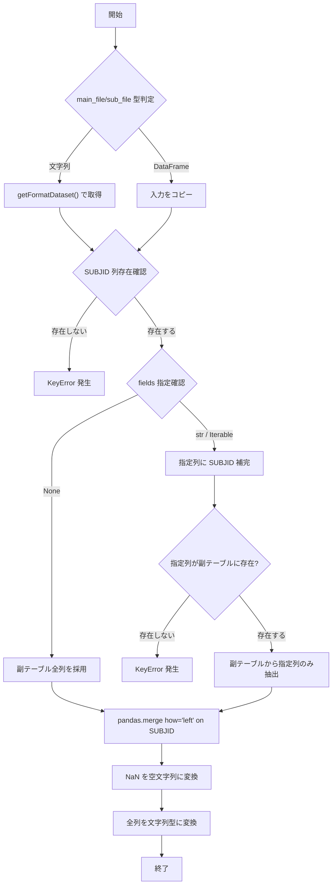
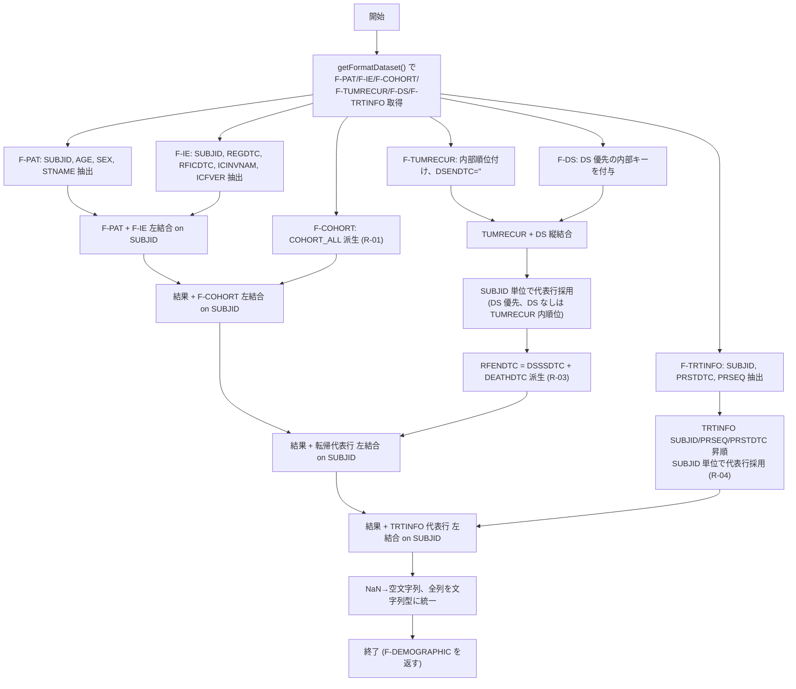
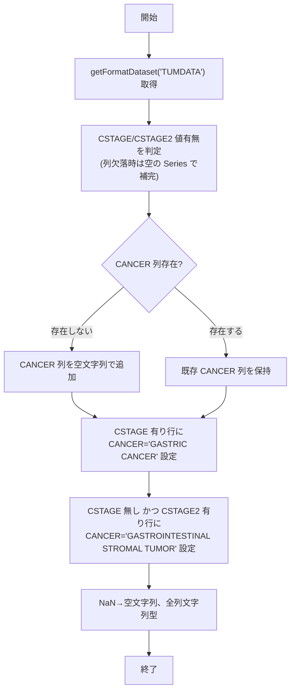

<!-- TEMPLATE: replace {{...}} placeholders from _STUDY_INPUT_PROFILE.md. -->
<!-- Constraints: see _BACKGROUND_INTERNAL.md (why) and _BC05_TO_DOCS_AGENT_GUIDE.md (how). -->
<!-- DD records internal specs (signatures, algorithms, data structures, TCs). -->
<!-- RULE-GUARD §5.2: §0 ファイル名列挙は必ず「連携設定の責務」帰属注付き。 -->
<!-- RULE-GUARD §7: §2.6.1 / §2.6.3 派生は「業務意図」と「A 組実装」を二層で記す。 -->
<!-- RULE-GUARD guide §10.4: 禁词「機能群」「研究」「病院」「主導」「医療機関」 -->

# 詳細設計書
## {{FUNCTION_MODULE}}

| 項目 | 内容 |
|-----|------|
| 文書番号 | DD-{{STUDY_ID}}-001 |
| 版数 | 1.0 |
| 作成日 | {{CREATE_DATE_JP}} |
| 最終更新日 | {{UPDATE_DATE_JP}} |
| 作成者 | {{AUTHOR}}（Group A） |
| レビュー者 | {{REVIEWER}} |
| 承認者 | {{APPROVER}} |
| 文書ステータス | Draft (レビュー待ち) |
| 対象システム | {{STUDY_ID}} スタディ固有処理 |
| 対象モジュール | `{{FUNCTION_MODULE_PATH}}` |
| 参照文書 | 要件定義書 (RD-{{STUDY_ID}}-001), 基本設計書 (BD-{{STUDY_ID}}-001) |

---

## 0. 実装方針 (Technical Approach)
<!-- RULE-GUARD §5.2: ファイル名列挙は連携設定の責務を明示 -->

本モジュールは Python + pandas を用いて実装する。
**Group A 開発担当者への指示**:
- データの結合は `pandas.merge` の `how='left'` を使用すること。
- 文字列結合は `DataFrame.agg(''.join, axis=1)` を用い、空欄も空文字列として参加させること。
- 列の有無確認は `column in df.columns` を使用し、欠落時は `pandas.Series(False, index=...)` で空の Series を補完すること（堅牢性確保）。
- 警告または検知結果を出力する場合は `print` または標準の `logging` モジュールを使用すること。
- 整形済データの取得は `VC_BC03_fetchConfig.getFormatDataset(*fileNames)` を経由し、各関数内で直接ファイル I/O を行わないこと。
- 本モジュールの関数は上位工程から連携設定に基づいて実行される。戻り値 DataFrame の保存先・ファイル名・ファイル形式 (`F-COHORTREG.csv` / `F-DEMOGRAPHIC.csv` / `F-TUMDATA.csv` 等) は連携設定 (`{{OPERATION_CONF}}`) で定義され、本 DD の対象外とする (本 DD は戻り値 DataFrame の内部仕様までを規定する)。
- 文書粒度ルール: RD は業務要件 (WHAT) のみ、BD は外部仕様 (機能の I/O 責務とルール) のみ、本 DD で内部仕様 (関数シグネチャ、アルゴリズム、データ構造、フロー、例外、試験) を規定する。

---

## 1. left_join_on_SUBJID 関数

### 1.1 機能概要

SUBJID をキーとして主テーブルと副テーブルを左結合する汎用関数。`getFormatDataset()` から取得した整形済データ (F-*) を入力として動作し、副テーブルからの抽出フィールドを柔軟に指定でき、結合結果は NaN を空文字列に変換し、全列を文字列型として返す。現行 {{STUDY_ID}} 実装では、`F-COHORT` に `F-IE` の REGDTC を結合して戻り値 DataFrame を生成する用途にも使用する (戻り値 DataFrame の保存ファイル名は連携設定の責務)。

**対応要件ID:** FR-01, FR-03, FR-04

### 1.2 関数シグネチャ

```python
def left_join_on_SUBJID(main_file=None, sub_file=None, fields=None) -> pandas.DataFrame
```

### 1.3 入力仕様

| パラメータ名 | 型 | 必須 | 説明 |
|------------|---|-----|------|
| main_file | str / pandas.DataFrame | ○ | 主テーブルの整形済テーブル名 (例: "F-COHORT" 相当の "COHORT") または DataFrame |
| sub_file | str / pandas.DataFrame | ○ | 副テーブルの整形済テーブル名 または DataFrame |
| fields | Iterable[str] / str / None | - | 副テーブルから保持する列名。既定は副テーブル全列。 |

#### 呼び出し例
```python
# テーブル名指定パターン (F-COHORT に F-IE の REGDTC を左結合した DataFrame を返す。
# 戻り値 DataFrame の保存ファイル名 F-COHORTREG.csv は連携設定の責務)
left_join_on_SUBJID(main_file="COHORT", sub_file="IE", fields=["REGDTC"])

# DataFrame 直接指定パターン
left_join_on_SUBJID(main_df, sub_df, fields=None)
```

### 1.4 出力仕様

| 戻り値 | 型 | 説明 |
|-------|---|------|
| merged_df | pandas.DataFrame | 左結合済み DataFrame。NaN は空文字列、全列が文字列型。 |

### 1.5 処理フロー



### 1.6 例外処理

| 例外 | 発生条件 |
|-----|---------|
| ValueError | `main_file` または `sub_file` が None |
| KeyError | 指定テーブルが整形済データセットに存在しない、または SUBJID 列が存在しない、または `fields` で指定した列が副テーブルに存在しない |

---

## 2. get_DEMOGRAPHIC_Data 関数

### 2.1 機能概要

{{STUDY_ID}} スタディの DEMOGRAPHIC 情報を生成する。整形済データ (F-PAT/F-IE/F-COHORT/F-TUMRECUR/F-DS/F-TRTINFO) の 6 ソースを SUBJID キーで左結合し、COHORT_ALL・RFENDTC の派生フィールドおよび転帰・投与情報の代表行採用を行う。

**対応要件ID:** FR-02, FR-05, FR-06, FR-07

### 2.2 関数シグネチャ

```python
def get_DEMOGRAPHIC_Data() -> pandas.DataFrame
```

### 2.3 データソース仕様 (整形済 F-* データ)

#### F-PAT (症例基本情報) — 主テーブル

| フィールドID | 日本語名 | データ型 | 例 |
|-------------|---------|---------|-----|
| SUBJID | 症例 ID | 文字列 | 1 |
| AGE | 年齢 | 文字列 | 39 |
| SEX | 性別 | 文字列 | M / F |
| STNAME | 施設名 | 文字列 | 実施施設 |

#### F-IE (同意・登録情報)

| フィールドID | 日本語名 | データ型 | 例 |
|-------------|---------|---------|-----|
| SUBJID | 症例 ID | 文字列 | 1 |
| REGDTC | 登録日 | 文字列 | 2020-10-13 |
| RFICDTC | 同意取得日 | 文字列 | 2020-10-02 |
| ICINVNAM | 同意取得者 | 文字列 | (担当医師名) |
| ICFVER | 同意書版数 | 文字列 | v1.1 |

#### F-COHORT (コホート情報) — 相互排他前提

| フィールドID | 日本語名 | データ型 | 例 |
|-------------|---------|---------|-----|
| SUBJID | 症例 ID | 文字列 | 3 |
| COHORT | 主コホート | 文字列 | GASTRIC CANCER COHORT |
| COHORTA | コホート A | 文字列 | GASTRIC GIST COHORT A |
| COHORTB | コホート B | 文字列 | GASTRIC GIST COHORT B |

#### F-TUMRECUR (腫瘍再発・転帰)

| フィールドID | 日本語名 | データ型 | 例 |
|-------------|---------|---------|-----|
| SUBJID | 症例 ID | 文字列 | 1 |
| FLWNUM | フォロー番号 | 文字列 | 04-001 |
| OUTCOME | 転帰 | 文字列 | UNKNOWN / ALIVE / DEAD |
| DSSSDTC | 判定日 | 文字列 | 2022-11-04 |
| DEATHDTC | 死亡日 | 文字列 | (空 / 2023-02-11) |

#### F-DS (スタディ中止・終了)

| フィールドID | 日本語名 | データ型 | 例 |
|-------------|---------|---------|-----|
| SUBJID | 症例 ID | 文字列 | 1 |
| OUTCOME | 転帰 | 文字列 | COMPLETED / DEATH |
| DSSSDTC | 判定日 | 文字列 | 2026-02-20 |
| DEATHDTC | 死亡日 | 文字列 | (空) |
| DSENDTC | 試験終了日 | 文字列 | 2026-02-20 |

#### F-TRTINFO (投与情報)

| フィールドID | 日本語名 | データ型 | 例 |
|-------------|---------|---------|-----|
| SUBJID | 症例 ID | 文字列 | 1 |
| PRSTDTC | 投与開始日 | 文字列 | 2020-10-15 |
| PRSEQ | 投与順番 | 文字列 | 1 |

### 2.4 出力フィールド仕様 (F-DEMOGRAPHIC)

| No. | フィールドID | 日本語名 | データ型 | 派生ロジック |
|-----|-------------|---------|---------|-------------|
| 1 | SUBJID | 症例 ID | 文字列 | F-PAT より継承 |
| 2 | AGE | 年齢 | 文字列 | F-PAT より継承 |
| 3 | SEX | 性別 | 文字列 | F-PAT より継承 |
| 4 | STNAME | 施設名 | 文字列 | F-PAT より継承 |
| 5 | REGDTC | 登録日 | 文字列 | F-IE より結合 |
| 6 | RFICDTC | 同意取得日 | 文字列 | F-IE より結合 |
| 7 | ICINVNAM | 同意取得者 | 文字列 | F-IE より結合 |
| 8 | ICFVER | 同意書版数 | 文字列 | F-IE より結合 |
| 9 | COHORT | コホート | 文字列 | F-COHORT より結合 |
| 10 | COHORTA | コホート A | 文字列 | F-COHORT より結合 |
| 11 | COHORTB | コホート B | 文字列 | F-COHORT より結合 |
| 12 | COHORT_ALL | コホート統合値 | 文字列 | **派生** (2.6.1 参照) |
| 13 | ORDER | 順序キー | 文字列 | **派生** (2.6.2 参照) |
| 14 | OUTCOME | 転帰 | 文字列 | 転帰代表行より結合 |
| 15 | DSSSDTC | 判定日 | 文字列 | 転帰代表行より結合 |
| 16 | DEATHDTC | 死亡日 | 文字列 | 転帰代表行より結合 |
| 17 | DSENDTC | 試験終了日 | 文字列 | 転帰代表行より結合 (DS 由来時のみ値) |
| 18 | RFENDTC | スタディ終了日 | 文字列 | **派生** (2.6.3 参照) |
| 19 | PRSTDTC | 投与開始日 | 文字列 | F-TRTINFO 代表行より結合 |
| 20 | PRSEQ | 投与順番 | 文字列 | F-TRTINFO 代表行より結合 |

### 2.5 処理フロー



### 2.6 派生ロジック詳細
<!-- RULE-GUARD §7: 業務意図と A 組実装を二層で記述。B 組が独立に推導可能であること -->

#### 2.6.1 COHORT_ALL (コホート統合値)

```python
cohort_df['COHORT_ALL'] = cohort_df[['COHORT', 'COHORTA', 'COHORTB']].agg(''.join, axis=1)
```

| 条件 | COHORT_ALL 値 |
|-----|-------------|
| COHORT のみ値あり | "GASTRIC CANCER COHORT" |
| COHORTA のみ値あり | "GASTRIC GIST COHORT A" |
| COHORTB のみ値あり | "GASTRIC GIST COHORT B" |
| 全て空欄 | 空文字列 |

> [!IMPORTANT]
> **前提**: COHORT、COHORTA、COHORTB は相互排他的 (同時に複数が値を持たない)。
> **A/B 比対観点**: 複数列が同時に値を持つ前提違反データでは、A 組現行実装 (文字列連結) と B 組の業務意図実装 (唯一の非空値採用または前提違反検知) で結果または検知結果が異なる可能性がある。これは R-01 前提違反の検知ポイントとして扱う。

#### 2.6.2 転帰代表行採用

| 条件 | 代表行採用 |
|-----|------------|
| F-DS 由来行あり | F-DS 由来行を代表行として採用 |
| F-DS 由来行なし、F-TUMRECUR 由来行あり | F-TUMRECUR 内の定義済み順位に基づく代表行を採用 |
| 両方なし | 転帰関連項目は空文字列 |

> [!IMPORTANT]
> **代表行採用**: 実装上は代表行選択用の内部優先キーを用いる。優先キーの具体値や生成方法は実装詳細であり、外部仕様として固定しない。

#### 2.6.3 RFENDTC (スタディ終了日)

**業務意図** (BD R-03): 判定日 (DSSSDTC) と死亡日 (DEATHDTC) のうち値を持つ方を採用する。R-02 で代表行が一意化されている前提のもと、両者は同時には値を持たないことを想定する。

**A 組現行実装**:

```python
outcome_df['RFENDTC'] = outcome_df[['DSSSDTC', 'DEATHDTC']].agg("".join, axis=1)
```

| 条件 | RFENDTC 値 (現行実装) | 業務意図との一致 |
|-----|----------|--------------|
| DSSSDTC のみ値あり | DSSSDTC 値 | 一致 |
| DEATHDTC のみ値あり | DEATHDTC 値 | 一致 |
| 両者値あり | 連結文字列 (例 "2022-11-042023-02-11") | 業務前提違反時の挙動。B 組実装と差分が出る可能性あり |
| 両者空 | 空文字列 | 一致 |

> [!IMPORTANT]
> **A/B 比対観点**: B 組が「いずれか値を持つ方を採用」(coalesce) で実装した場合、両者値ありデータに対して A 組 (連結) と B 組 (先頭採用) で結果が異なる。これは R-02 の代表行一意化前提が破れているデータの検知ポイントとして機能する。

### 2.7 結合仕様

| 結合順序 | 左テーブル | 右テーブル | キー | 結合方式 |
|---------|----------|----------|-----|---------|
| 1 | F-PAT | F-IE | SUBJID | LEFT JOIN |
| 2 | 結果1 | F-COHORT (COHORT_ALL 付与済) | SUBJID | LEFT JOIN |
| 3 | F-TUMRECUR | F-DS | (縦結合) | CONCAT |
| 4 | 結果3 | (RFENDTC 派生済 代表行 outcome_df) | - | 代表行採用後 fillna |
| 5 | 結果2 | 結果4 | SUBJID | LEFT JOIN |
| 6 | 結果5 | F-TRTINFO 代表行 | SUBJID | LEFT JOIN |

### 2.8 データ品質チェック観点

| No. | チェック内容 | 期待挙動 |
|-----|------------|---------|
| 1 | COHORT/COHORTA/COHORTB の同時値あり | 相互排他前提違反の確認対象。現行実装では COHORT_ALL は連結文字列となる (BD R-01 業務前提違反時挙動)。 |
| 2 | F-TUMRECUR/F-DS いずれも欠損 | 該当症例の OUTCOME/RFENDTC は空文字列となる。 |
| 3 | F-TRTINFO 欠損 | 該当症例の PRSTDTC/PRSEQ は空文字列となる。 |
| 4 | 代表行で DSSSDTC/DEATHDTC が同時値あり | 業務前提違反の確認対象 (BD R-03)。現行実装では RFENDTC は連結文字列となり、業務意図 (いずれか採用) と差分が出る。 |

---

## 3. TUMDATA_process 関数

### 3.1 機能概要

整形済 F-TUMDATA の臨床ステージ (CSTAGE/CSTAGE2) を判定基準として、癌種列 (CANCER) を付与する。

**対応要件ID:** FR-08

### 3.2 関数シグネチャ

```python
def TUMDATA_process() -> pandas.DataFrame
```

### 3.3 入出力仕様

**入力:**
- F-TUMDATA: 整形済腫瘍データ。`CSTAGE` (主要分類)、`CSTAGE2` (補助分類) を含む。

**出力:**
- F-TUMDATA に `CANCER` 列を付与した DataFrame。NaN は空文字列、全列が文字列型。

### 3.4 処理フロー



### 3.5 判定ロジック詳細

```python
cstage_has_value = _has_value('CSTAGE')
cstage2_has_value = _has_value('CSTAGE2')
tumdata_df.loc[cstage_has_value, 'CANCER'] = 'GASTRIC CANCER'
tumdata_df.loc[~cstage_has_value & cstage2_has_value, 'CANCER'] = 'GASTROINTESTINAL STROMAL TUMOR'
```

| 条件 | CANCER 値 |
|-----|---------|
| CSTAGE が空でない | GASTRIC CANCER |
| CSTAGE が空、CSTAGE2 が空でない | GASTROINTESTINAL STROMAL TUMOR |
| 両者が空 | 空文字列 |

> [!IMPORTANT]
> **優先順位**: CSTAGE > CSTAGE2

### 3.6 堅牢性配慮

- CSTAGE 列または CSTAGE2 列が F-TUMDATA に存在しない場合でも、内部関数 `_has_value()` は `pandas.Series(False, index=...)` を返し、処理を継続する。
- 通常入力の F-TUMDATA は CANCER 列を持たない前提である。CANCER 列が既に存在する場合でも、CSTAGE/CSTAGE2 の判定条件に該当する行は判定結果で更新する。いずれの条件にも該当しない行は実装上の堅牢性挙動として既存値を保持する。

---

## 4. サンプルデータ (代表パターンに基づく)

### 4.1 入力データ例

**F-PAT（主要列抜粋）**
| SUBJID | AGE | SEX | STNAME |
|--------|-----|-----|--------|
| 1 | 39 | M | 実施施設 |
| 4 | 72 | M | 実施施設 |

**F-COHORT（主要列抜粋）**
| SUBJID | COHORT | COHORTA | COHORTB |
|--------|--------|---------|---------|
| 1 | GASTRIC CANCER COHORT | | |
| 4 | | | GASTRIC GIST COHORT B |

**F-TUMRECUR（主要列抜粋）**
| SUBJID | FLWNUM | OUTCOME | DSSSDTC | DEATHDTC |
|--------|--------|---------|---------|----------|
| 1 | 04-001 | UNKNOWN | 2022-11-04 | |
| 4 | 03-001 | DEAD | | 2023-02-11 |

### 4.2 出力データ例

**F-DEMOGRAPHIC（主要列抜粋）**
| SUBJID | AGE | SEX | COHORT_ALL | ORDER | OUTCOME | RFENDTC | PRSTDTC |
|--------|-----|-----|-----------|-------|---------|---------|---------|
| 1 | 39 | M | GASTRIC CANCER COHORT | 04 | UNKNOWN | 2022-11-04 | 2020-10-15 |
| 4 | 72 | M | GASTRIC GIST COHORT B | 03 | DEAD | 2023-02-11 | 2017-09-11 |

**F-TUMDATA 処理後（主要列抜粋）**
| SUBJID | CSTAGE | CSTAGE2 | CANCER |
|--------|--------|---------|--------|
| 1 | I | | GASTRIC CANCER |
| 2 | IIB | | GASTRIC CANCER |
| (GIST 症例) | | Localized | GASTROINTESTINAL STROMAL TUMOR |

## 5. テスト仕様

| TC-ID | 対応要件ID | テストケース | 入力条件 | 期待結果 | 証跡ID | 実施結果 |
|------|-----------|------------|---------|---------|-------|---------|
| TC-01 | FR-01, FR-03, FR-04 | left_join_on_SUBJID 正常系 (テーブル名指定 / COHORTREG 生成) | COHORT + IE.REGDTC | F-COHORTREG 相当のデータが生成され、NaN が空文字列、全列文字列型で返される | EV-TC-001 | Pending |
| TC-02 | FR-01, FR-03 | left_join_on_SUBJID 正常系 (DataFrame 指定) | 任意 DataFrame 2 件 | 左結合が成立し、列名衝突時は接尾辞を付与 | EV-TC-002 | Pending |
| TC-03 | FR-01 | left_join_on_SUBJID 異常系 | None / 存在しないテーブル名 / SUBJID 欠落 | ValueError / KeyError 発生 | EV-TC-003 | Pending |
| TC-04 | FR-02, FR-05, NFR-02 | DEMOGRAPHIC 統合 + COHORT_ALL 派生 | 6 整形済ソース、COHORT のみ値ありの代表症例パターン (例: SUBJID=1) | 相互排他前提のもと、値を持つコホート分類が COHORT_ALL として採用される | EV-TC-004 | Pending |
| TC-05 | FR-06, NFR-02 | 転帰代表行採用と RFENDTC 派生 | TUMRECUR と DS の両方ありの症例、DS なしで TUMRECUR のみ存在する症例 | DS が存在する症例では DS 由来行が代表行として採用され、DS が存在しない症例では TUMRECUR 内順位に基づく代表行が採用される。RFENDTC は DSSSDTC/DEATHDTC のうち値を持つ方として派生される | EV-TC-005 | Pending |
| TC-06 | FR-07, NFR-02 | TRTINFO 代表行採用 | 同一 SUBJID に複数 PRSEQ の行 | SUBJID/PRSEQ/PRSTDTC 昇順で先頭行が代表行として採用される | EV-TC-006 | Pending |
| TC-07 | FR-08, NFR-02 | 癌種判定 | CSTAGE のみ / CSTAGE2 のみ / 両方空 の 3 ケース | GASTRIC CANCER / GASTROINTESTINAL STROMAL TUMOR / 空 で判定される | EV-TC-007 | Pending |
| TC-08 | FR-09 | 上位工程連携確認 | 連携設定経由でスタディ固有関数呼び出し | 関数呼び出しが成功し F-COHORTREG / F-DEMOGRAPHIC / F-TUMDATA が生成される | EV-TC-008 | Pending |
| TC-09 | FR-10 | トレーサビリティ確認 | RD/BD/DD/Code/Test を機械照合 | 対応漏れなし | EV-TC-009 | Pending |
| TC-10 | NFR-01 | 性能検証 | 擬似データ (1 万件) 処理 | 3 秒以内に完了 | EV-PERF-001 | Pending |
| TC-11 | NFR-04, NFR-05 | セキュリティ・監査性確認 | ログおよび出力結果確認 | 出力項目が戻り値仕様に必要な最小範囲であること、版数記録があること | EV-SEC-001, EV-AUD-001 | Pending |
| TC-12 | FR-06, NFR-02, NFR-03 | R-03 業務前提違反検知 (DSSSDTC/DEATHDTC 同時値) | 代表行に DSSSDTC と DEATHDTC が同時に値を持つ擬似データ | 現行 A 組実装では RFENDTC は連結文字列となる (業務意図 = いずれか採用 と差分)。B 組実装との比対で検知可能 | EV-TC-012 | Pending |
| TC-13 | FR-05, NFR-02, NFR-03 | R-01 業務前提違反検知 (COHORT/COHORTA/COHORTB 同時値) | COHORT と COHORTA または COHORTB が同時に値を持つ擬似データ | 現行 A 組実装では COHORT_ALL は連結文字列となる。B 組が業務意図どおり唯一の非空値採用または前提違反検知で実装した場合、比対で差分または不整合を検知可能 | EV-TC-013 | Pending |

---

## 6. 要件-設計-実装-試験トレーサビリティ

| 要件ID | 詳細設計の対応節 | 実装対応 | テストID | 戻り値/連携観点 |
|-------|------------------|---------|---------|------------|
| FR-01 | 1.1-1.6 | `{{FUNCTION_MODULE_PATH}}` `left_join_on_SUBJID` | TC-01, TC-02, TC-03 | 汎用結合 |
| FR-02 | 2.3, 2.7, 2.8 | `{{FUNCTION_MODULE_PATH}}` `get_DEMOGRAPHIC_Data` 結合処理 | TC-04 | F-DEMOGRAPHIC |
| FR-03 | 1.4, 2.8, 3.3 | `{{FUNCTION_MODULE_PATH}}` 戻り値生成前 `fillna('').astype(str)` | TC-01, TC-02 | 共通戻り値形式 |
| FR-04 | 1.1-1.6 | `{{FUNCTION_MODULE_PATH}}` `left_join_on_SUBJID` による F-COHORTREG 生成 | TC-01 | F-COHORTREG |
| FR-05 | 2.6.1 | `{{FUNCTION_MODULE_PATH}}` COHORT_ALL 派生 | TC-04, TC-13 | F-DEMOGRAPHIC |
| FR-06 | 2.6.2, 2.6.3 | `{{FUNCTION_MODULE_PATH}}` 転帰代表行採用・RFENDTC 派生 (RFENDTC 現行実装は連結、業務意図は採用) | TC-05, TC-12 | F-DEMOGRAPHIC |
| FR-07 | 2.7 結合順序 6 | `{{FUNCTION_MODULE_PATH}}` TRTINFO 代表行採用 | TC-06 | F-DEMOGRAPHIC |
| FR-08 | 3.4, 3.5 | `{{FUNCTION_MODULE_PATH}}` `TUMDATA_process` | TC-07 | F-TUMDATA |
| FR-09 | 0 章, 各関数 1 章 | 上位工程からのスタディ固有処理連携 | TC-08 | 呼び出し連携 |
| FR-10 | 5 章, 6 章 | トレーサビリティマトリクス/テスト実施記録 | TC-09 | 文書追跡 |
| NFR-01 | 0 章 | pandas 処理実装 (ベクトル化) | TC-10 | - |
| NFR-02..05 | 2.8, 3.6, 5 章 | 品質チェック観点、堅牢性配慮、必要最小限の項目出力 | TC-11, TC-12, TC-13 | - |

---

## 7. 変更履歴

| 版数 | 日付 | 変更内容 | 担当者 | Git Commit |
|-----|------|---------|--------|------------|
| 1.0 | {{TODAY_SLASH}} | 新規作成。`left_join_on_SUBJID`、`get_DEMOGRAPHIC_Data`、`TUMDATA_process` の関数契約、処理フロー、派生・判定ロジック、代表パターン、テスト仕様、および要件-設計-実装-試験トレーサビリティを整備。 | {{AUTHOR}}（Group A） | - |
