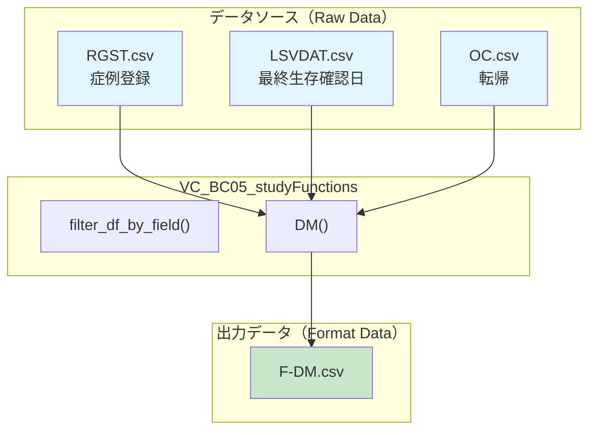
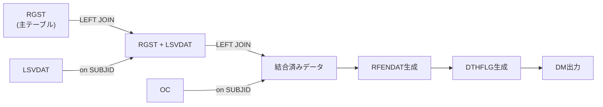

# 基本設計書
## VC_BC05_studyFunctions モジュール

| 項目 | 内容 |
|-----|------|
| 文書番号 | BD-ENSEMBLE-001 |
| 作成日 | 2026年02月02日 |
| 作成者 | |
| 対象システム | SDTM_ENSEMBLE マッピング仕様書 |
| 対象モジュール | VC_BC05_studyFunctions.py |

---

## 1. 概要

本モジュールは、ENSEMBLE研究特有のデータ処理機能を提供する。主に以下の2つの機能を含む：

1. **汎用データ筛選機能** (`filter_df_by_field`)
2. **DM (Demographics) データセット生成機能** (`DM`)

---

## 2. システム構成図

---

## 3. 機能一覧

| No. | 関数名 | 機能概要 | 入力 | 出力 |
|-----|--------|---------|------|------|
| 1 | `filter_df_by_field` | 汎用データ筛選機能 | DataFrame または テーブル名 | 筛選済みDataFrame |
| 2 | `DM` | Demographics データセット生成 | なし（内部でデータ取得） | DM DataFrame |

---

## 4. 外部インターフェース

### 4.1 依存モジュール

| モジュール名 | 用途 |
|-------------|------|
| VC_BC03_fetchConfig | データセット取得機能 (`getFormatDataset`) |
| VC_BC04_operateType | 型操作機能 |
| pandas | データフレーム操作 |
| numpy | 数値計算 |

### 4.2 入力データファイル

| ファイル名 | 日本語名 | 主要フィールド | レコード数（参考） |
|-----------|---------|----------------|-------------------|
| RGST.csv | 症例登録 | SUBJID, SEXCD, AGE | 約201件 |
| LSVDAT.csv | 最終生存確認日 | SUBJID, LSVDAT | 約189件 |
| OC.csv | 転帰 | SUBJID, DTHDAT | 約114件 |

### 4.3 出力データファイル

| ファイル名 | フィールド構成 |
|-----------|---------------|
| F-DM.csv | SUBJID, SEXCD, AGE, LSVDAT, DTHDAT, RFENDAT, DTHFLG |

---

## 5. データフロー

### 5.1 DM関数のデータフロー

---

## 6. 非機能要件

| 項目 | 要件 |
|-----|------|
| パフォーマンス | 200件程度のデータを1秒以内に処理 |
| データ整合性 | 欠損値は空文字列として処理 |
| ログ出力 | データ品質警告をコンソール出力 |

---

## 7. 制限事項・前提条件

1. 入力データはCSV形式であること
2. SUBJIDはすべてのテーブルで一意の識別子として使用
3. 日付形式は YYYY-MM-DD または YYYY/MM/DD

---

## 8. 関連文書

| 文書名 | 備考 |
|--------|------|
| 詳細設計書_VC_BC05_studyFunctions.md | 詳細設計書 |
| ENSEMBLE_OperationConf.xlsx | 設定ファイル |
