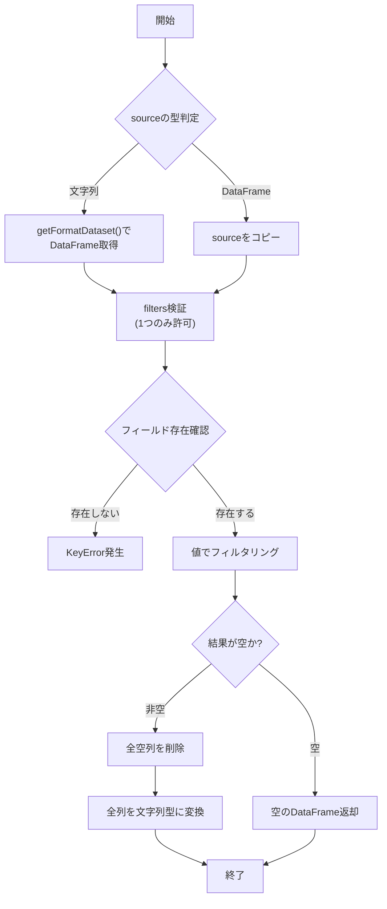
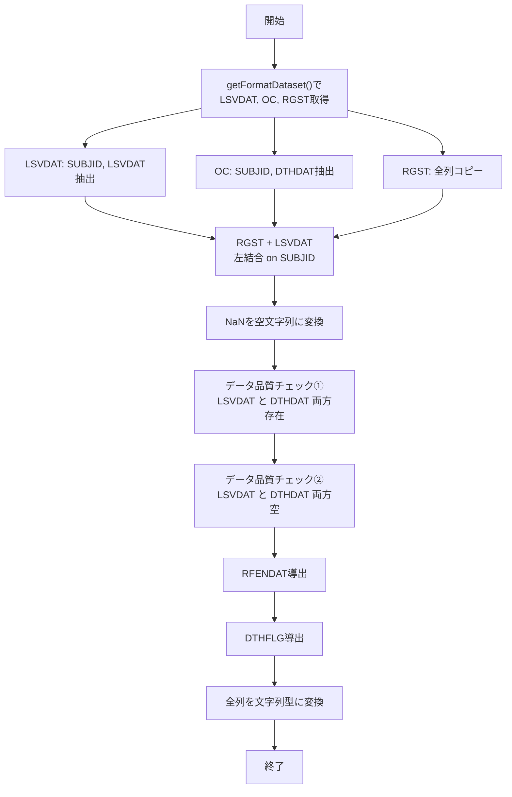

# 詳細設計書
## VC_BC05_studyFunctions

| 項目 | 内容 |
|-----|------|
| 文書番号 | DD-ENSEMBLE-001 |
| 作成日 | 2026年02月13日 |
| 作成者 | |
| 対象システム | SDTM_ENSEMBLE マッピング仕様書 |
| 対象モジュール | VC_BC05_studyFunctions.py |
| 参照文書 | 要件定義書 (RD-ENSEMBLE-001), 基本設計書 (BD-ENSEMBLE-001) |

---

## 0. 実装方針 (Technical Approach)
本モジュールは Python + pandas を用いて実装する。
**Group A 開発担当者への指示**:
- データの結合は必ず `pd.merge` の `how='left'` を使用すること。
- 日付比較ロジックでは、`pd.isnull()` や `fillna('')` を適切に使用し、NaN の伝播を防ぐこと。
- 警告出力は `print` または標準の `logging` モジュールを使用すること。

---

## 1. filter_df_by_field 関数

### 1.1 機能概要

指定された条件でDataFrameをフィルタリングし、全空列を除去した結果を返却する汎用関数。

### 1.2 関数シグネチャ

```python
def filter_df_by_field(source, **filters) -> pd.DataFrame
```

### 1.3 入力仕様

| パラメータ名 | 型 | 必須 | 説明 |
|------------|---|-----|------|
| source | str, pd.DataFrame | ○ | テーブル名文字列またはDataFrame |
| **filters | dict | ○ | フィルタリング条件（1つのみ指定可能） |

#### filters の例
```python
filter_df_by_field('TME', EventId='AT REGISTRATION')
filter_df_by_field(tme_df, EventId='AT REGISTRATION')
```

### 1.4 出力仕様

| 戻り値 | 型 | 説明 |
|-------|---|------|
| filtered_df | pd.DataFrame | フィルタリング済み、全列が文字列型 |

### 1.5 処理フロー



### 1.6 例外処理

| 例外 | 発生条件 |
|-----|---------|
| ValueError | source が None、または filters が1つでない |
| TypeError | source が DataFrame でも文字列でもない |
| KeyError | 指定フィールドが存在しない、またはテーブル名が見つからない |

---

## 2. DM 関数

### 2.1 機能概要

臨床試験の症例統計情報（DM）データセットを生成する。複数のデータソースを結合し、研究終了日と死亡フラグを導出する。

### 2.2 関数シグネチャ

```python
def DM() -> pd.DataFrame
```

### 2.3 データソース仕様

#### RGST（症例登録）- 主テーブル

| フィールドID | 日本語名 | データ型 | 例 |
|-------------|---------|---------|-----|
| SUBJID | 症例ID | 文字列 | NE-EN-0001 |
| SEXCD | 性別コード | 文字列 | M / F |
| AGE | 同意取得時年齢 | 数値 | 34 |

#### LSVDAT（最終生存確認日）

| フィールドID | 日本語名 | データ型 | 例 |
|-------------|---------|---------|-----|
| SUBJID | 症例ID | 文字列 | NE-EN-0001 |
| LSVDAT | 最終生存確認日 | 日付 | 2025/11/10 |

#### OC（転帰）

| フィールドID | 日本語名 | データ型 | 例 |
|-------------|---------|---------|-----|
| SUBJID | 症例ID | 文字列 | NE-EN-0001 |
| DTHDAT | 死亡日 | 日付 | 2025/10/31 |

### 2.4 出力フィールド仕様

| No. | フィールドID | 日本語名 | データ型 | 導出ロジック |
|-----|-------------|---------|---------|-------------|
| 1 | SUBJID | 症例ID | 文字列 | RGSTから継承 |
| 2 | SEXCD | 性別コード | 文字列 | RGSTから継承 |
| 3 | AGE | 同意取得時年齢 | 文字列 | RGSTから継承 |
| 4 | LSVDAT | 最終生存確認日 | 文字列 | LSVDATから結合 |
| 5 | DTHDAT | 死亡日 | 文字列 | OCから結合 |
| 6 | RFENDAT | 研究終了日 | 文字列 | **導出**（下記参照） |
| 7 | DTHFLG | 死亡フラグ | 文字列 | **導出**（下記参照） |

### 2.5 処理フロー



### 2.6 導出ロジック詳細

#### RFENDAT（研究終了日）

```python
RFENDAT = DTHDAT if DTHDAT != '' else LSVDAT
```

| 条件 | RFENDAT値 |
|-----|----------|
| DTHDATが存在する | DTHDAT |
| DTHDATが空、LSVDATが存在する | LSVDAT |
| 両方空 | 空文字列 |

> [!IMPORTANT]
> **優先順位**: DTHDAT > LSVDAT

#### DTHFLG（死亡フラグ）

```python
DTHFLG = 'Y' if DTHDAT != '' else ''
```

| 条件 | DTHFLG値 |
|-----|---------|
| DTHDATが存在する | Y |
| DTHDATが空 | 空文字列 |

### 2.7 データ品質チェック

| No. | チェック内容 | 警告メッセージ例 |
|-----|------------|-----------------|
| 1 | LSVDATとDTHDATが両方存在 | `[DM] 警告: X 名の症例に LSVDAT と DTHDAT が同時に存在します` |
| 2 | LSVDATとDTHDATが両方空 | `[DM] 警告: X 名の症例の LSVDAT と DTHDAT が共に空です` |

### 2.8 結合仕様

| 結合順序 | 左テーブル | 右テーブル | キー | 結合方式 |
|---------|----------|----------|-----|---------|
| 1 | RGST | LSVDAT | SUBJID | LEFT JOIN |
| 2 | 結果1 | OC | SUBJID | LEFT JOIN |

---

## 3. サンプルデータ

### 3.1 入力データ例

**RGST.csv**
| SUBJID | SEXCD | AGE |
|--------|-------|-----|
| NE-EN-0001 | M | 34 |
| NE-EN-0015 | M | 49 |
| NE-EN-0027 | M | 52 |

**LSVDAT.csv**
| SUBJID | LSVDAT |
|--------|--------|
| NE-EN-0001 | 2025/11/10 |
| NE-EN-0027 | - |

**OC.csv**
| SUBJID | DTHDAT |
|--------|--------|
| NE-EN-0015 | 2025/10/31 |
| NE-EN-0027 | 2025/10/20 |

### 3.2 出力データ例

**F-DM.csv**
| SUBJID | SEXCD | AGE | LSVDAT | DTHDAT | RFENDAT | DTHFLG |
|--------|-------|-----|--------|--------|---------|--------|
| NE-EN-0001 | M | 34 | 2025-11-10 | | 2025-11-10 | |
| NE-EN-0015 | M | 49 | | 2025-10-31 | 2025-10-31 | Y |
| NE-EN-0027 | M | 52 | | 2025-10-20 | 2025-10-20 | Y |

---

## 4. テスト仕様

| No. | テストケース | 期待結果 |
|-----|------------|---------|
| 1 | LSVDATのみ存在する症例 | RFENDAT = LSVDAT, DTHFLG = 空 |
| 2 | DTHDATのみ存在する症例 | RFENDAT = DTHDAT, DTHFLG = Y |
| 3 | LSVDAT と DTHDAT 両方存在 | RFENDAT = DTHDAT, DTHFLG = Y, 警告出力 |
| 4 | LSVDAT と DTHDAT 両方空 | RFENDAT = 空, DTHFLG = 空, 警告出力 |
| 5 | 存在しないフィールドで filter | KeyError 発生 |

---

## 5. 変更履歴

| 版数 | 日付 | 変更内容 | 担当者 |
|-----|------|---------|--------|
| 1.0 | 2026/02/02 | 初版作成 | |
| 1.1 | 2026/02/13 | 基本設計書からの詳細ロジック移行、実装方針の追記 | |
